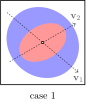

$$
\DeclareMathOperator{\E}{\text{\textrm{\textbf{E}}}}
\DeclareMathOperator{\var}{\text{\textrm{\textbf{Var}}}}
\newcommand{\given}[1][]{\,#1|\,}
\newcommand{\iidto}{\overset{\text{\scriptsize iid}}{\sim}}
\newcommand{\dto}{\overset{d}{\longrightarrow}}
\newcommand{\pto}{\overset{p}{\longrightarrow}}
\newcommand{\symbT}{\top}
\newcommand{\T}{^{\symbT}}
\newcommand{\inv}{^{-1}}
\newcommand{\invT}{^{-\symbT}}
%%
\newcommand{\vv}{\mathbf{v}}
\newcommand{\KK}{\mathbf{K}}
\newcommand{\BB}{\mathbf{B}}
\newcommand{\AA}{\mathbf{A}}
$$

Consider two covariance matrices $A_{n\times n}$ and $B_{n\times n}$.
We say that $A$ is *bigger* or *larger* than $B$,
often denoted by $A\geq B$ or $A\succeq B$,
if $A-B$ is **semi-positive definite**.
Why do we use the "definiteness" of a matrix to compare the size of two covariance matrices?

# Semi-positiveness

## Interpretation 1

First, notice that a covariance matrix is not only symmetric,
but also semi-positive definite.
Consider a random vector $X=(x_1,...,x_n)\T$.
The covariance matrix is defined by
$$
\begin{aligned}
\KK &\coloneqq \E{(X-\E{X})(X-\E{X})\T}.
\end{aligned}
$$
Given any constant vector $\vv$ of length $n$, we have
$$
\begin{aligned}
\vv\T \KK \vv &= \E{\vv\T(X-\E{X})(\vv\T(X-\E{X}))\T} \geq 0
\end{aligned}
$$
by the definition of $\KK$.
Therefore, the covariance matrix $\KK$ is semi-positive definite.
In fact, $\vv\T\KK\vv$ is zero iff $X$ has no variance at all.

## Interpretation 2

There is another intuitive way of interpreting the positive definiteness of covariance matrices.
Consider the same vector $\vv$ and the random vector $X$.
The dot product $\vv\T X$ is the *projection* of the random vector from $n$-dimensional
space on a one-dimensional space along the direction of $\vv$, i.e.,
this collapse the $n$-dimensional random variable to a one-dimensional random variable through some linear combination.

If we calculate the variance of the one-dimensional random variable $\vv\T X$, we obtain
$$
\begin{aligned}
\var(\vv\T X)
&= \E{\vv\T X(\vv\T X)\T } - \E{\vv\T X}\E{\vv\T X}\T  \\
&= \vv\T \big(\E{XX\T } - \E{X}\E{X}\T \big)\vv \\
&= \vv\T\KK\vv.
\end{aligned}
$$
Notice that the variance assumes the exact form as before.
And since variance is always non-negative,
it is clear that the covariance matrix must be semi-positive definite.
That is, for any direction $\vv$,
the variance of **$X$ projected on that direction** is (clearly) non-negative.

# Comparison of Covariance Matrices

Let $X=(x_1,...,x_n)\T$ and $Y=(y_1,...,y_n)\T$ be random vectors with mean $(0,...,0)\T$ for simplicity.
Let $\AA=\E{XX\T}$ and $\BB=\E{YY\T}$ be the covariance matrices.
Our goal is to compare $\AA$ and $\BB$ in some meaningful way.

Motivated by the second interpretation,
we can project $X$ and $Y$ on a vector $\vv$,
and then compare the variance (non-negative real number) of the two projections.
To make the comparison meaningful,
it is reasonable to compare **all** possible projections,
i.e., consider all possible choices of $\vv$.

Formally, consider any vector $\vv$.
The projection of $X$ on $\vv$ is $\vv\T X$.
The variance of $\vv\T X$ is 
$$
\begin{aligned}
\E{(\vv\T X)^2}
&= \E{\vv\T XX\T\vv} \\
&= \vv\T\E{XX\T}\vv
= \vv\T\AA\vv
\end{aligned}
$$
where $A$ is the covariance matrix.
Similarly, consider the same for $Y$.
If we find that $\forall\vv$,
$$
\begin{align*}
\vv\T\AA\vv - \vv\T\BB\vv
= \vv\T(\AA-\BB)\vv
\geq 0,
\end{align*}
$$
then, by definition, $\AA-\BB$ is semi-positive definite.
Now we know why we say $\AA$ is *larger* than $\BB$ when $\AA-\BB$ is positive definite:

> $\AA-\BB$ being positive definite means that for **all possible directions**,
> the variance of $X$ is larger than $Y$'s.

This order of semi-positive definite matrices is called the [Löwner order](https://en.wikipedia.org/wiki/Loewner_order).

# Visualization

This interpretation of the partial ordering can be understood easily through visualisation.
The following are representations of the distributions $X$ and $Y$ where the
two random vectors are two-dimensional:

Let $X$ with covariance matrix $\AA$ be the *blue* distribution and $Y$ with
covariance matrix $\BB$ be the **red** distribution.

- It is clear that in case 1, $\AA$ is *bigger* than $\BB$ since the variance of $X$ is
  bigger that $Y$'s in every direction.
- However, the same statement is not true in case 2.
  In some directions (e.g. $\vv_1$), the variance of $X$ is larger;
  in other directions (e.g. $\vv_2$), the variance of $Y$ is larger.
  Thus, $\AA$ and $\BB$ are not comparable in this case.
