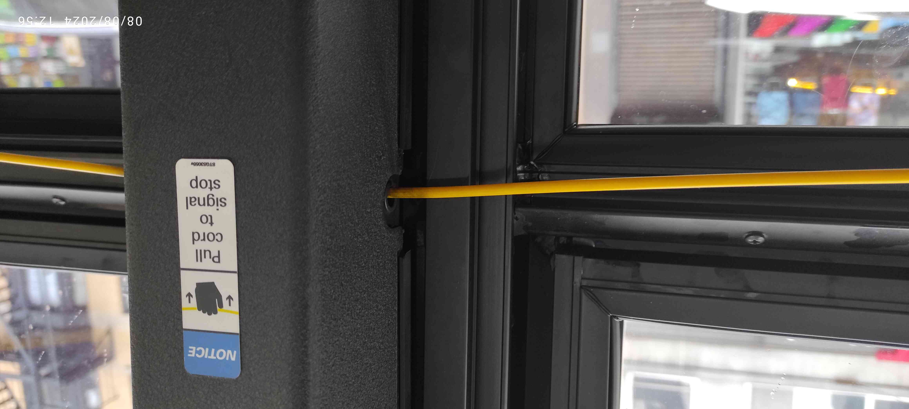
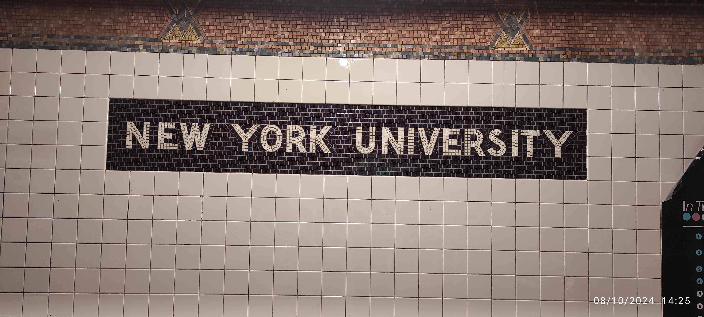
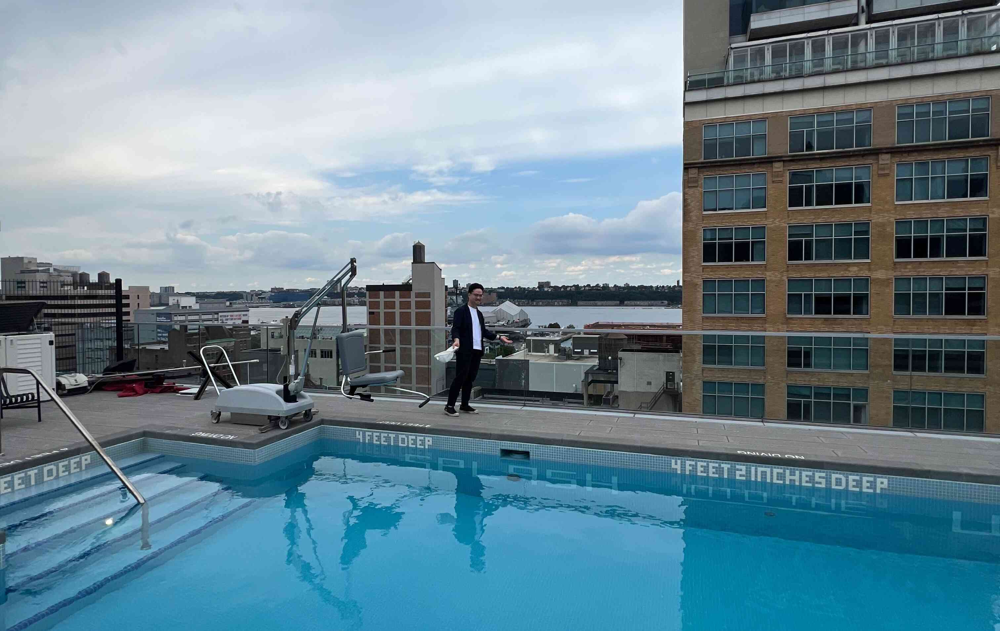

# 序

單純記錄一些在紐約的所見所聞還有心情，
所以以意識流（俗稱流水帳）的體例寫作。

# 2024-08-07

從 `2024-08-01` 到紐約到現在過一個禮拜了，
記錄一下所見所聞跟心情。

來到紐約的第二天領略到紐約的物價，這個三明治花了我 $17；
份量確實是很多，但是結帳的時候嚇到。
吃下去之後覺得超好吃，
可以說是 Subway 的超級豪華版（當然價格也是超級豪華版⋯），
所以好像也還行，
只是要分成兩餐吃，不然會被自己吃垮。
但是這一個禮拜過下來（大概知道這邊的物價水準之後）覺得分兩餐吃其實算是很便宜，
是可以常吃的東西，
所以這週大部分午餐晚餐都是在這家店解決。
已經把這家店的菜單拿回家，
準備把大部分的三明治菜單都吃過一遍。

哥倫比亞的北方就是 Harlem，是有名的黑人區。
從機場到哥倫比亞的 Uber 上經過 Harlem 就被警告說這邊比較危險，看起來也是有點恐怖。
傍晚稍微往北邊走的時候就看到橋墩上有「COLUMBIA OUT of HARLEM NOW!」的塗鴉。
哥倫比亞在 1896 年移到現在的校址（原本在洛克斐勒中心旁邊，更早之前在馬哈頓更南方），
過了一百多年還是格格不入。
走在路上也有明確的感覺，
一旦往北到 125 街左右就明顯感受到街上的氛圍變得很不一樣。
通常這種地方應該要仕紳化吧？或許是 Harlem 的基因太強了。

會往北走是因為要去跟一個朋友的朋友買地毯跟一些東西，
放到房間變這樣：

後來又添購了冷氣（也是往北方走去買來二手的），
落地燈是幹來的，
基本上該有的機能都有了。

前面提到到 125 街以上氛圍就很不一樣，
後來有天到時代廣場附近逛逛才知道什麼叫做都市：

其實時代廣場附近幾個街區（大概是 30 到 50 街多左右，這邊被稱為 midtown）都長這樣，
那天也去看了洛克斐勒中心（看到 Tonight Show starring Jimmy Fallon 的看板）、
中央車站（無聊）、第五大道（往南看滿壯觀的）。
在附近還看到無印良品還有 Line 商店：

從外面看裡面全部都是東亞面孔，笑死。我家附近則是長這樣：

跟曼哈頓 midtwon 完全是兩樣風情，
甚至都還沒去精華中之精華區 downtown。
後來聽朋友說他覺得其實 80 街以上就有點 sketchy（哥倫比亞在 110 到 120 街左右），
我算是同意，
80 街大概就是中央公園的一半的地方，
往北就比較住宅、越北方越龍蛇雜處，
往南則是無比繁榮（雖然路邊一樣不少流浪漢）。
之後應該會盡量避免往超過哥倫比亞校區太北方的地方，
多往南邊走。

這週花不少時間在整理家裏（打掃房間、廁所、廚房）跟處理一些行政事務（手機、銀行、social security number）。
我有兩個室友，
目前只見到一個（印度人，工程類 PhD），
另一個暑假不在。
印度人口音偏重，需要用力聽，但是人很好，很多東西願意跟我分享。
之前有聽說印度人普遍衛生習慣不太好，
印度室友感覺衛生習慣普通，
不是說很不衛生，
但是會放任廚房一些油污堆積在灶台上那種。
我覺得這種好像跟一些在 Reddit 上面看到的美國人差不了多少，
所以我也不會說非常差，
但是算是到我無法接受的程度，
所以這週花很多時間在打掃。
之後應該是可以維持現在打掃後的模樣吧。

另外一件北七的事，
今天室友煮午餐是煮鮭魚，
我還特地問他說他打算怎麼煮（前天晚上他在半夜煎牛肉，他的作息不是非常規律），
他說用煎的，我就說好。
過半小時之後我再到客廳發現濃煙密佈，
然後警報器就開始叫。
我去廚房就看到鮭魚整個焦掉 = =。
後來他叫舍監過來，
舍監也沒辦法，
就只能把所有窗戶都打開。
我在開窗戶的時候腳抽筋（不要問我為什麼），因為要超用力開（不要問我為什麼）。
幸好沒有什麼灑水器，
不然我真的會把他打爆。
整間房子都是燒焦鮭魚的味道，
過了兩三個小時才消散。

來到這邊幾天才有點意識到自己要在這邊待好久，
心情其實有點複雜。
發現自己真的要開始為自己的生命負責了，
而且是有學校保護的 easy mode 開始，
又覺得自己頗草莓。
最一開始幾天比較緊張，買東西之前都會跟自己對話好幾次說等一下要怎麼講。
現在比較好了，有餘裕規劃一天要做什麼，
而不是整天在緊繃的狀態。
希望在開始認識更多人之後有更好的心境轉換。

最後附上哥倫比亞大學地鐵站的照片：

紐約的地鐵真的是又髒又臭，
而且只有部分車廂是有冷氣的，
沒冷氣就是坐在蒸籠裡面晃，
可能錢都花在這個馬賽克上（幾乎每一站的牆面都是馬賽克）。
因為還沒有學生證跟迎新導覽，
所以只到校園裡面快速走過一次。
等到可以暢行無阻的時候再仔細看跟拍照。

# 2024-08-15

紐約也是很常下雨，而且下雨了就會蠻冷的，大概再20度左右。
而且蠻多人不撐傘的其實雨也不小，特別是很多白人不撐傘不，太知道為什麼。

過兩個禮拜之後發現在紐約（我想甚至是整個美國）人種劃分是很明確的：
像是速食店或雜貨店或做工的都是西班牙裔的，
送外賣啊什麼或零元購商人的很多都是黑人，
白人真的看起來大部分都在做高級工作，亞洲人也是。
以下就是零元購交易市場，在中國城附近：

在哥倫比亞附近聽到很多中文，但應該是因為中國學生多的關係。
這樣看來紐約或甚至是美國的確是一個蠻讓人覺得沮喪的地方，階級的不流動直接以人種的方式呈現給你看。
至少在台灣大家看起來都一樣，所以看不出來？
話說，幾乎都很哪裡都有講西班牙文的機會，果然跟我之前一個同學說的很像：「西班牙文是美國台語」。
連紐約地鐵的官方告示都有英語西班牙語雙語。

這禮拜第一次煮東西，自己煮下來發現其實跟外面買的價格並不會差很多（但這是給定你把一個三明治分成兩餐吃的情況）。
自己煮的話大概算了一下就是 \$5 左右，營養比較均衡。範例：

美國的豬肉確實有股騷味，但是我覺得我能接受。

紐約地鐵真是可以看到形形色色的人的地方。
第一次在地鐵上看到猶太拉比，也有在地鐵上看到拉丁裔的爸爸跟女兒在賣零食討生活，真的是大熔爐。
紐約猶太人真的很多，走在路上（特別是越接近金融區的地方）很容易看到公開配戴基帕的人。
比較智障的是看到告示寫說「Subway surfing is dangerous, please ride in the subway」，
看起來比較熔爐的地方也比較猴。
逃票仔也是很多，而且這個感覺不分族裔，大家有機會就逃票？？
但是我要更正一個上週的觀察，
就是其實大部分地鐵是有冷氣的，
只是不知道為什麼第一次做的時候剛好坐到沒冷氣的？
害我對於沒冷氣的 prior 很強。

有天心血來潮去 IKEA，
因此第一次到布魯克林區。
看起來跟北曼哈頓差不多破，但是感覺比哈頓更「有機」一點：街道不是井然有序的網格狀，房屋也是歪七扭八？
還看到[倉儲挖寶王](https://zh.wikipedia.org/zh-hant/%E5%80%89%E5%84%B2%E6%8C%96%E5%AF%B6%E7%8E%8B)裡面會出現的倉儲。
因為 IKEA 滿遠的，所以也第一次坐巴士。
沒特別感覺，只是覺得這種東西好像是很久以前（70 年代？）台灣公車會出現的東西：

IKEA 東西好便宜，可能中國留學生也知道，店裡面超多中國留學生，到處都在講中文。
回程的時候地鐵突然燈暗掉很正常，還看到有人把腳踏車鎖在把手上，很屌。

8/9 剛拿到學生證，拿到的第一件事就是去參觀學校附近的大教堂，非常壯觀的教堂，
跟歐洲有得比，但是裡面有很多美國元素很有趣，
例如這個有棒球、橄欖球、曲棍球圖樣的彩繪玻璃：

後來某天去了中國城，
途中經過紐約大學地體站：

紐約大學真的是沒有 campus，滿無聊的，
就是走在附近會突然看到紫色的旗子：

過一陣子又會看到一個，
就這樣。
而且途中第一次在大白天看到有人坐在路邊打毒品（針頭打到手臂），嗯。

中國城是個又髒又醜，而且被廣東話佔領，要是能避免的話不會想再去。
倒是到處都是青天白日滿地紅，滿好笑的。

最後在附近謁見了中山跟仲尼之後便快速離開：

又過了一個禮拜之後發現其實曼哈頓 downtwon 分區也非常明顯：
說不只是說「uptown 糟糕、downtaon 繁華」，
因為中國城跟前面拍照到的零元購散貨中心都是在 downtown。
我也因此發現其實哥倫比亞校區附近真的是很安全，
感覺一切都光明磊落，又常有學校的公共安全小組（不知道 Public Safty 中文叫什麼）開車巡邏，
而且又相對安靜，
不失為是個好地方。

去完中國城就跑去金融區，
其實金融區反而無聊，就是金牛附近都是人（小女孩沒了）：

旁邊看到一個川普建築跟紐約證交所（川普大樓除了斗大的 Trump Building 字樣就沒啥可看的，就不放照片）：

Meh，還去了原本世貿中心，現在是 911 紀念公園的地方。
我是覺得頗無聊，沒什麼有趣的東西。
這幾天發現紐約很難跟臺北一樣自己去逛？
走在路上不是吃的就是一些賣垃圾紀念品的店。
希望之後多認識一些人之後可以做一些比較有趣的事情。

晚上跟印度室友出去外面吃飯，
第一次在晚上到哈林區吃披薩，正宗拿波里披薩，很不錯。
然後發現他女朋友是蒙古人？？？滿屌的。
哈林區其實晚上也不是說超級恐怖（但還是滿亂的），要注意就是了。

某天整個中午到晚上都跟某朋友還有他的一些台灣朋友在他家頂樓，滿開心的（過好幾天第一次講這麼多中文？）。
以下是他家海景（河景？）第一排頂樓的樣子：

轉過身背後就是繁華無比的曼哈頓。
第一次 shotgun、pickle ball⋯等，族繁不及備載。
只能說才來沒多久就能在這種地方搞東搞西真是命好。

莫名其妙在一家超市（不是亞超，所以意外）看到伊藤園產地台灣的綠茶：

價格是一旁牛奶先生的三倍，但還是買了，好喝。

最後這幾天都在認真看一些計量經濟學的文章，
所以沒做太多有趣的事。
而且因為 Math Camp 從這禮拜一開始（線上），
所以早上也不能亂跑。
Math Camp 真的是頗無聊，
例如光是集合的包含關係、交集、聯集就講的一個小時。
所以其實我都是在做自己的事，呵呵。
但是至少老師跟助教（都是經濟博士生）人非常好，所以我也沒有太多抱怨，
就當作複習一些基本觀念吧，
而且之後可能會講的 Kuhn-Tucker 都快忘光的，還是要複習一下。

今天下午偷閒還是跑出來亂晃，
看到熨斗大夏（整修中）：

其實原本是先去 [MoMath](https://momath.org/)，
以為是超 nerdy 的地方（其實算是滿 nerdy），
但是到了之後發現好像主要是給小朋友玩的（裡面有很多像是士林科教館的東西），
就沒進去了。
之後想要找看看紐約有沒有類似誠品這種文創類型的商店，
但是我半個都沒找到。
只要經過一些精緻的書店，所以才說紐約很難逛⋯。

最後附上一張哥倫比亞圖書館的照片：

那天去看才仔細看到上面的刻字，滿霸氣的：

> King's College Founded in the Province of New York by the Royal Charter in the Reign of George II
> Perpetuated as Columbia College by the People of the State of New York
> when They Became Free and Independent -
> Maintained and Cherished from Generation to Generation
> for the Advancement of the Public Good and the Glory of Almighty God

讀完其實覺得滿感動的，但是同時又覺得有[背景音樂](https://www.youtube.com/watch?v=MhQ5678cJU8)，滿好笑的。

感覺自己越來越像是當地人了，比較不焦慮，也比較之後各種事情的處理方式，
還打電話去跟洗衣機公司要存錯的 \$15，真的是來紐約還是要當客家人。
滿期待下週的實體 Math Camp，第一次見到之後朝夕相處的同學，下次再來人物誌。

# 2024-08-25

再次體現美國語言多樣性，
官方的地鐵公告都要三語，
好笑的是中文是晶晶體：

這週開始實體 Math Camp，
終於見到同學了，
但是也重新發現社交真的很累人。
不是說英語說得不好，
而是要一直尬聊真的很燒腦，
要一直想一些雞毛涮皮的事情來填空，
諸如：「你有沒有寵物？」、「你喜歡什麼音樂？」⋯不及備載。
當然也有比較務實的：「到底什麼時候需要給小費？」，
至少這個時候非美國人就可以統一戰線討論公制系統的優越性。

好，人物誌。
這屆哥大經濟系的人總共有 31 個，
據說這是正常大小，
前幾年比較少（大概剩 16 個）純粹是因為 Covid。
班上大概 1/3 是美國人，剩下來自世界各地。
中國人 4 個、印度人 2 個、馬來西亞人 1 個、巴西人 3 個、加泰隆尼雅人 1 個、義大利人 2 個、奧地利人 1 個、
韓國人 1 個、西非法國人（忘記他說是哪個國家了，但是他大學研究所都在法國完成）1 個、
日本人 1 個、芬蘭人 1 個、波蘭人 1 個、俄羅斯人 1 個、智利人 1 個。
性別比倒是非常可悲，沒記錯應該只有 5 個女生。

中國人意外的熱情？就是不會自己搞小圈圈，甚至有一個比美國人還多話，然後也會講德文，頗有趣；
有一個還跟我講很羨慕當台灣人可以去小巨蛋聽演唱會，因為他很喜歡蔡依林；
而且沒人跟我抬槓區域政治問題，所以很不錯。
巴西人好像平常沒有說特別熱情，但是這週五在酒吧的聚會就是他們揪的，所以算熱情？
義大利人倒是一直講義大利文，比較小圈圈。
奧地利人也是話很多，然後他對國共內戰有不少了解，有驚訝到。
在酒吧的時候才第一次跟加泰隆尼雅人對話，第一個話題不外乎區域政治。
法國人口音最重，也是全班唯一一個黑人，是第一個說他注意到中文使用者全部都不使用原本的名字而使用另一個英語名字，呵呵。
日本人說他有來去年的 AASLE，念早稻田，但是是大阪人，所以當我說我只去過關西地區時非常高興。
芬蘭人長得超級芬蘭人，頭髮金到快要變成透明的。

再來就是美國人。
美國人普遍愛講話，但是最愛講話的不是美國人。
感覺在這個 program 的美國人也比較不驕傲，外國人調侃美國的一些事情的時候他們非常理解（像是小費文化）。
而且好多美國人都在聯準會工作過，有兩個之前就在紐約聯準會工作。
美國人不是最愛講話的原因是他們在這裡可能本來就有朋友圈，但是外國人普遍沒有，所以可能比較急於交朋友？

但是總體而言大家都非常友善，但是感覺沒有天才類型的人，到時候看看吧。

Math Camp 滿無聊的，基本上都是你有上大學就應該要會的東西。
寫作業花一些時間，但是就是每週10題，所以負擔不會太大。
唯一之前沒有太認真學過的東西只有下禮拜要講的 correspondence 吧，
當然在個論上都講過，但是不太了解一些相關的數學性質。

其中一天去 orientation，滿無聊的，花超多時間再講性騷擾防治跟 consent，
可能在美國真的是大問題吧？或者是在台灣也是大問題只是沒有這樣超正式的官方宣傳？
場地倒是非常豪華，是舊圖書館，現在是行政大樓：

週五跟幾乎整個班的人到酒吧喝酒，蠻不錯的。
有趣的是酒吧是在一艘船上，所以不知道是自己醉還是船在晃，呵呵。
然後喝完酒之後跟一個美國人去買 Chipotle 其實真的滿好吃的，特別是在有點微醺的狀態。
而且也不是說很貴，大概就 11 到 15 塊左右，讚。

今天還跟有些人去哥大的一個美術館，但是展覽偏無聊，太現代，不太喜歡。
但是後來又去逛到有名的 Apollo Theater 那邊，有歷史文化感，而且走在路上還看到曼德拉的紀念牌，真的酷。

然後晚上到一個在長島上的地方 Flushing 跟台灣朋友吃烤肉，到了才知道那便是所謂「新」中國城，
比曼哈頓上的更亂，而且顯然這邊是比較「後來」才來的人，到處都是簡體字。
我們去吃一個烤串，是滿好吃的，價格也不會太貴，但是進到店裡就被用中文問幾位蠻好笑的。

但是這邊真的有點亂，短期也不會想來，而且其實也沒什麼特別的，只是因為台灣朋友要搭飛機所以才來這邊離機場近的地方。
前幾天也跟他們去吃一家韓式料理，吃到這個炸魚，跟台灣自助餐吃到的完全一樣，家鄉味：

這是某天再來走去拍的卡內基音樂廳，在整修，所以滿廢的：

但是走到那邊途中有看到中央公園的馬，讚：

這是跟哥大密切合作的猶太神學院，1920 年代建成，上面寫著斗大「And the Bush was not Consumed」，非常猶太：

某天去坐渡輪，天氣跟風景都超讚：

坐度輪是專門跑去看這個著名的拍照景點，
但是旁邊藍色鷹架超級大，很煩，
不知道為什麼我去的地方好多都在整修。
照理來說在橋墩中間可以看到帝國大廈，
但是被冰淇淋車擋住，
真的很煩。

最後附上這幾天才拿到的紐約市立圖書館卡，
滿好看的，有鑰匙圈也有卡，覺得自己更像是紐約居民了。

總體而言這週真的是社交能量消耗殆盡，
希望之後聊天可以不要一直講一些雞毛涮皮的無聊事情。
可能是之前在台灣朋友都太奇怪，
整天動不動就是誠意正心跟虛假不虛假。
可能我要努力成為這邊儒家的使徒吧。

# 2024-09-02

這週好是大學部報到，
所以人越來越多。
也看到以色列對抗巴勒斯坦的示威又有零星的開始，
遠遠的就可以看到以色列國旗還有很多猶太人：

原本以為猶太人是支持以色列，
但是走近一看發現不是：

然後附近超級無敵多警察，呵呵。
最後沒發生什麼事就是了，真無聊。

發現好像都還沒放一些學校的照片，
今天特地去拍了一些。
這是校園裡面的小教堂，滿精緻的，據說一些哥大的學生會在這裡結婚。

這是數學館，名字就叫 Mathematics，其他建築都是有冠名，像是 Pulitzer（我也是這禮拜才知道普立茲攝影獎在哥大頒發）。
有人笑稱因為唸數學的人都太窮沒有人有錢可以冠名，所以只能叫 Mathematics。
但是前面有草坪，所以讚。

據說這是很有名的「學者之獅」，必須說我沒聽過，
而且不知道為什麼這獅子很瘦。

這個角落很有名：

嗯。就在現在主要的 Butler 圖書館旁邊：

內裝很 old money，而且圖書館裡面有胡適的畫像，下次在去拍：

這個週五 Math Camp 剛結束。
Math Camp 結束是考了一個試，
在家裡考，說是說不能翻書，但是完全沒有監考；
題目倒是簡單到翻書都是浪費時間就是了⋯。
一考完試就跟一些人去跑步（要逼自己去運動，我甚至還跟他們去打籃球⋯），
聽到一些人說題目很難，
我覺得難以理解。

參加了不少社交活動，
如果我在台灣都覺得自己缺乏對於流行文化的認知，
到這邊真的是被放大一千萬倍。
大家好像什麼影集或電影都有看，什麼明星都知道，什麼音樂都有在聽，什麼運動都有在跟。
有天我被邀說要不要去看網球公開賽，
說票價現在降到 \$100 以下。
原本想說就當作體驗去看看，
但是後來票價突然飛漲到 \$150 以上大家便作罷，
最後是到某人住處看直播。
美國人真的是對於運動有很強的堅持，
只要談話中有人一提到就會至少花 30 分鐘講個痛快。
歐洲人跟南美洲人也是，特別是講到足球更是滔滔不絕。
我只能在旁邊笑笑的。
大家對於音樂也是有非常多瞭解，
各種聽團跟邀去演唱會的，
只能說我興趣缺缺。
或許是在台灣的朋友太包容我對於音樂流行文化一無所知，
聊天的時候都可以不用講這些。

另外美國人好像對什麼東西都可以編出一個偏好，
就是無論問題是什麼，
都可以🦐講個至少一分鐘。
像是在酒吧有人問我喜歡什麼音樂，
我就覺得有點答不上來，
因為感覺自己沒特別關注誰，就是隨便聽聽而已。
但是美國人的回答不一樣，
會說自己個 playlist 是一大坨東西什麼都有，
然後扯到說這樣在健身房會突然有難過的歌害他很難健身，
然後再扯到說有他有一些電影的 soundtrack 很喜歡，
然後就可以扯到電影。
其實總結一下就是他也沒有特別關注什麼，
但是就可以講一大坨。
越來越理解為什麼 TOEFL 的口說是設計成這樣，
因為美國人就是明明也沒什麼高見但是就可以滔滔不絕⋯。

Math Camp 考試早上結束，
我中午去跑步（差點死掉），
下午去野餐。
氣氛是滿不錯的，但是又是大家瞎聊時間，講了一整個下午 = =。
最後都是跟日本人講話，
因為感覺跟西方人講化真的累，
隨時都要準備噴一大坨，
主題都不外乎運動、音樂、電影，
沒有一個我特別在意的東西。
後來跟日本人決定隔天去大都會博物館，
到了發現門票不是對學生完全免費，
但是你愛付多少錢都可以，只要在 $\mathbb{R}_{++}$ 都行。
進去之後發現我對於大都會有錯誤的期待，
不應該把它當作大英博物館或是羅浮宮看待。
因為要比從中東或非洲偷來的東西比不上大英博物館（但是這邊有一個很酷的埃及小廟），
要比歐洲傳統的藝術品又比不過羅浮宮，
都是一些有名的畫家的不有名作品。

但倒是有不少跟美國相關的東西就是了，像是這個。
畫框也超級美國，滿好笑的。

去完博物館去買東西，人生第一次看到手推車有專用電扶梯，不愧是美國，跟偷懶相關的東西都不讓我失望：

這週也把申請 SSN 的事情搞定了，
其實就是人過去把文件給他而已。
接洽我的是一個感覺英文說得不太好的華人大媽，
滿奇怪的，
但是我記得在預約時間的時候他確實有提到你可以選擇用中文溝通，
所以她可能就是扮演這種職責吧。
後來經過法院，看起來頗氣派。

上面刻字：

> The True Administration of Justice is the Firmest Pillar of Good Government

他們好像真的非常喜歡在建築上面刻一整句話，
但是又都是英文，
真的很美國精神，
自詡為現代的羅馬共和。

昨天去一些比較的景點。
其中一個是愛爾蘭飢荒紀念公園，
這邊重現了一個破爛的愛爾蘭平房，
紀念那些因為飢荒所以移民來美國的人：

然後附近有一小片柏林圍牆，
下面有個小牌子寫說這是德國領事館送給這個「公園」的，
不是送給美國或紐約市，
有點意義不明。

最後附上今天午餐照片：

廚藝沒什麼進步，
進步的倒是知道可以去買日式調味粉灑在菠菜上。
明天就要開學了（今天勞動節所以偷閒一天），
而且第一堂就是早八，
累。

<a href="#" class="back-to-top">↑</a>

