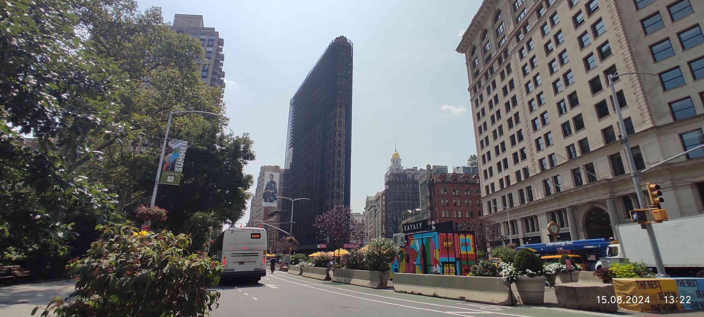
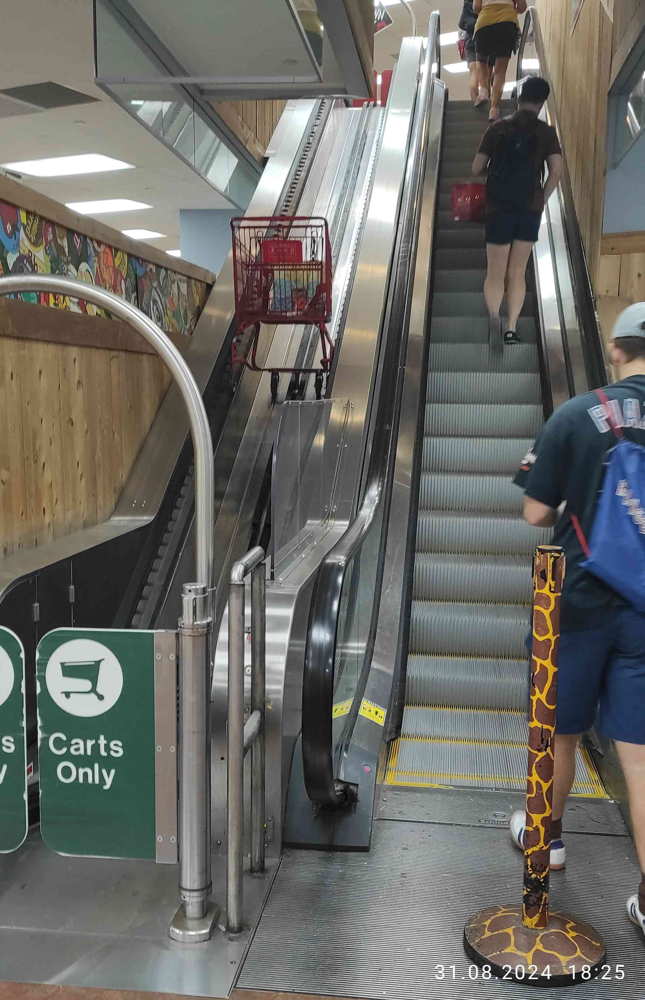
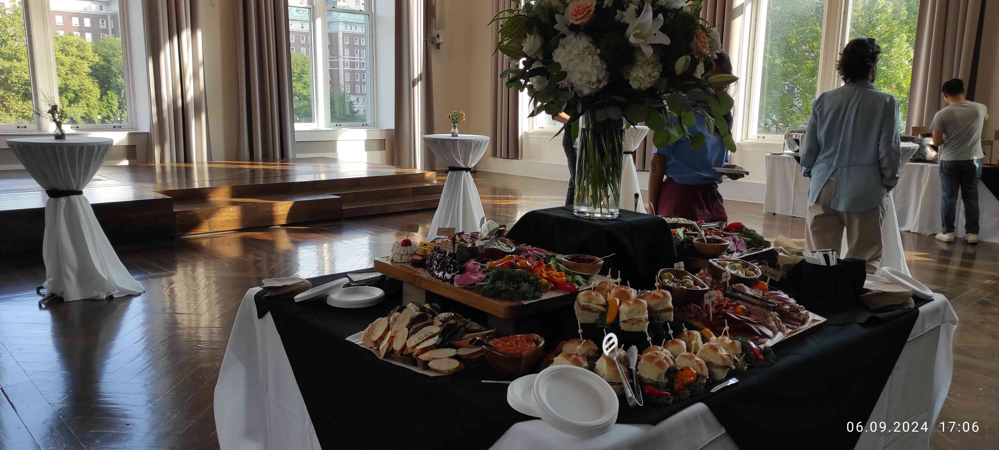
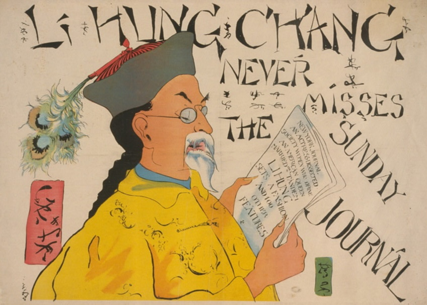

# 序 {#prologue}

> 奏為擬選聰穎子弟，前赴泰西各國，肄習技藝，以培人才，恭折仰祈聖鑒事。
>
> 
曾國藩〈擬選子弟出洋學藝折〉同治十年（1871）

單純記錄一些在紐約的所見所聞還有心情，
所以以<ruby><rb>意識流</rb><rp>（</rp><rt>流水帳</rt><rp>）</rp></ruby>的體例寫作。

# 2024-08-07 {#2024-08-07}

從 `2024-08-01` 到紐約到現在過一個禮拜了，
記錄一下所見所聞跟心情。

來到紐約的第二天領略到紐約的物價，這個三明治花了我 $17；
份量確實是很多，但是結帳的時候嚇到。
吃下去之後覺得超好吃，
可以說是 Subway 的超級豪華版（當然價格也是超級豪華版⋯），
所以好像也還行，
只是要分成兩餐吃，不然會被自己吃垮。
但是這一個禮拜過下來（大概知道這邊的物價水準之後）覺得分兩餐吃其實算是很便宜，
是可以常吃的東西，
所以這週大部分午餐晚餐都是在這家店解決。
已經把這家店的菜單拿回家，
準備把大部分的三明治菜單都吃過一遍。

哥倫比亞的北方就是 Harlem，是有名的黑人區。
從機場到哥倫比亞的 Uber 上經過 Harlem 就被警告說這邊比較危險，看起來也是有點恐怖。
傍晚稍微往北邊走的時候就看到橋墩上有「COLUMBIA OUT of HARLEM NOW!」的塗鴉。
哥倫比亞在 1896 年移到現在的校址（原本在洛克斐勒中心旁邊，更早之前在曼哈頓更南方），
過了一百多年還是格格不入。
走在路上也有明確的感覺，
一旦往北到 125 街左右就明顯感受到街上的氛圍變得很不一樣。
通常這種地方應該要士紳化吧？或許是 Harlem 的基因太強了。

會往北走是因為要去跟一個朋友的朋友買地毯跟一些東西，
放到房間變這樣：

後來又添購了冷氣（也是往北方走去買來二手的），
落地燈是幹來的，
基本上該有的機能都有了。

前面提到到 125 街以上氛圍就很不一樣，
後來有天到時代廣場附近逛逛才知道什麼叫做都市：

其實時代廣場附近幾個街區（大概是 30 到 50 街多左右，這邊被稱為 midtown）都長這樣，
那天也去看了洛克斐勒中心（看到 Tonight Show starring Jimmy Fallon 的看板）、
中央車站（無聊）、第五大道（往南看滿壯觀的）。
在附近還看到無印良品還有 Line 商店：

從外面看裡面全部都是東亞面孔，笑死。我家附近則是長這樣：

跟曼哈頓 midtown 完全是兩樣風情，
甚至都還沒去精華中之精華區 downtown。
後來聽朋友說他覺得其實 80 街以上就有點 sketchy（哥倫比亞在 110 到 120 街左右），
我算是同意，
80 街大概就是中央公園的一半的地方，
往北就比較住宅、越北方越龍蛇雜處，
往南則是無比繁榮（雖然路邊一樣不少流浪漢）。
之後應該會盡量避免往超過哥倫比亞校區太北方的地方，
多往南邊走。

這週花不少時間在整理家裏（打掃房間、廁所、廚房）跟處理一些行政事務（手機、銀行、social security number）。
我有兩個室友，
目前只見到一個（印度人，工程類 PhD），
另一個暑假不在。
印度人口音偏重，需要用力聽，但是人很好，很多東西願意跟我分享。
之前有聽說印度人普遍衛生習慣不太好，
印度室友感覺衛生習慣普通，
不是說很不衛生，
但是會放任廚房一些油污堆積在灶台上那種。
我覺得這種好像跟一些在 Reddit 上面看到的美國人差不了多少，
所以我也不會說非常差，
但是算是到我無法接受的程度，
所以這週花很多時間在打掃。
之後應該是可以維持現在打掃後的模樣吧。

另外一件北七的事，
今天室友煮午餐是煮鮭魚，
我還特地問他說他打算怎麼煮（前天晚上他在半夜煎牛肉，他的作息不是非常規律），
他說用煎的，我就說好。
過半小時之後我再到客廳發現濃煙密佈，
然後警報器就開始叫。
我去廚房就看到鮭魚整個焦掉 = =。
後來他叫舍監過來，
舍監也沒辦法，
就只能把所有窗戶都打開。
我在開窗戶的時候腳抽筋（不要問我為什麼），因為要超用力開（不要問我為什麼）。
幸好沒有什麼灑水器，
不然我真的會把他打爆。
整間房子都是燒焦鮭魚的味道，
過了兩三個小時才消散。

來到這邊幾天才有點意識到自己要在這邊待好久，
心情其實有點複雜。
發現自己真的要開始為自己的生命負責了，
而且是有學校保護的 easy mode 開始，
又覺得自己頗草莓。
最一開始幾天比較緊張，買東西之前都會跟自己對話好幾次說等一下要怎麼講。
現在比較好了，有餘裕規劃一天要做什麼，
而不是整天在緊繃的狀態。
希望在開始認識更多人之後有更好的心境轉換。

最後附上哥倫比亞大學地鐵站的照片：

紐約的地鐵真的是又髒又臭，
而且只有部分車廂是有冷氣的，
沒冷氣就是坐在蒸籠裡面晃，
可能錢都花在這個馬賽克上（幾乎每一站的牆面都是馬賽克）。
因為還沒有學生證跟迎新導覽，
所以只到校園裡面快速走過一次。
等到可以暢行無阻的時候再仔細看跟拍照。

# 2024-08-15 {#2024-08-15}

紐約也是很常下雨，而且下雨了就會蠻冷的，大概在20度左右。
而且蠻多人不撐傘的，其實雨也不小，特別是很多白人不撐傘，不太知道為什麼。

過兩個禮拜之後發現在紐約（我想甚至是整個美國）人種劃分是很明確的：
像是速食店或雜貨店或做工的都是西班牙裔的，
送外賣啊什麼或零元購商人的很多都是黑人，
白人真的看起來大部分都在做高級工作，亞洲人也是。
以下就是零元購交易市場，在中國城附近：

在哥倫比亞附近聽到很多中文，但應該是因為中國學生多的關係。
這樣看來紐約或甚至是美國的確是一個蠻讓人覺得沮喪的地方，階級的不流動直接以人種的方式呈現給你看。
至少在台灣大家看起來都一樣，所以看不出來？
話說，幾乎哪裡都有講西班牙文的機會，果然跟我之前一個同學說的很像：「西班牙文是美國台語」。
連紐約地鐵的官方告示都有英語西班牙語雙語。

這禮拜第一次煮東西，自己煮下來發現其實跟外面買的價格並不會差很多（但這是給定你把一個三明治分成兩餐吃的情況）。
自己煮的話大概算了一下就是 \$5 左右，營養比較均衡。範例：

美國的豬肉確實有股騷味，但是我覺得我能接受。

紐約地鐵真是可以看到形形色色的人的地方。
第一次在地鐵上看到猶太拉比，也有在地鐵上看到拉丁裔的爸爸跟女兒在賣零食討生活，真的是大熔爐。
紐約猶太人真的很多，走在路上（特別是越接近金融區的地方）很容易看到公開配戴基帕的人。
比較智障的是看到告示寫說「Subway surfing is dangerous, please ride in the subway」，
看起來比較熔爐的地方也比較猴。
逃票仔也是很多，而且這個感覺不分族裔，大家有機會就逃票？？
但是我要更正一個上週的觀察，
就是其實大部分地鐵是有冷氣的，
只是不知道為什麼第一次坐的時候剛好坐到沒冷氣的？
害我對於沒冷氣的 prior 很強。

有天心血來潮去 IKEA，
因此第一次到布魯克林區。
看起來跟北曼哈頓差不多破，但是感覺比曼哈頓更「有機」一點：街道不是井然有序的網格狀，房屋也是歪七扭八？
還看到[倉儲挖寶王](https://zh.wikipedia.org/zh-hant/%E5%80%89%E5%84%B2%E6%8C%96%E5%AF%B6%E7%8E%8B)裡面會出現的倉儲。
因為 IKEA 滿遠的，所以也第一次坐巴士。
沒特別感覺，只是覺得這種東西好像是很久以前（70 年代？）台灣公車會出現的東西：

IKEA 東西好便宜，可能中國留學生也知道，店裡面超多中國留學生，到處都在講中文。
回程的時候地鐵突然燈暗掉很正常，還看到有人把腳踏車鎖在把手上，很屌。

8/9 剛拿到學生證，拿到的第一件事就是去參觀學校附近的大教堂，非常壯觀的教堂，
跟歐洲有得比，但是裡面有很多美國元素很有趣，
例如這個有棒球、橄欖球、曲棍球圖樣的彩繪玻璃：

後來某天去了中國城，
途中經過紐約大學地鐵站：

紐約大學真的是沒有 campus，滿無聊的，
就是走在附近會突然看到紫色的旗子：

過一陣子又會看到一個，
就這樣。
而且途中第一次在大白天看到有人坐在路邊打毒品（針頭打到手臂），嗯。

中國城是個又髒又醜，而且被廣東話佔領，要是能避免的話不會想再去。
倒是到處都是青天白日滿地紅，滿好笑的。

最後在附近謁見了中山跟仲尼之後便快速離開：

又過了一個禮拜之後發現其實曼哈頓 downtown 分區也非常明顯：
說不只是說「uptown 糟糕、downtown 繁華」，
因為中國城跟前面拍照到的零元購散貨中心都是在 downtown。
我也因此發現其實哥倫比亞校區附近真的是很安全，
感覺一切都光明磊落，又常有學校的公共安全小組（不知道 Public Safety 中文叫什麼）開車巡邏，
而且又相對安靜，
不失為是個好地方。

去完中國城就跑去金融區，
其實金融區反而無聊，就是金牛附近都是人（小女孩沒了）：

旁邊看到一個川普建築跟紐約證交所（川普大樓除了斗大的 Trump Building 字樣就沒啥可看的，就不放照片）：

Meh，還去了原本世貿中心，現在是 911 紀念公園的地方。
我是覺得頗無聊，沒什麼有趣的東西。
這幾天發現紐約很難跟臺北一樣自己去逛？
走在路上不是吃的就是一些賣垃圾紀念品的店。
希望之後多認識一些人之後可以做一些比較有趣的事情。

晚上跟印度室友出去外面吃飯，
第一次在晚上到哈林區吃披薩，正宗拿波里披薩，很不錯。
然後發現他女朋友是蒙古人？？？滿屌的。
哈林區其實晚上也不是說超級恐怖（但還是滿亂的），要注意就是了。

某天整個中午到晚上都跟某朋友還有他的一些台灣朋友在他家頂樓，滿開心的（過好幾天第一次講這麼多中文？）。
以下是他家海景（河景？）第一排頂樓的樣子：

轉過身背後就是繁華無比的曼哈頓。
第一次 shotgun、pickle ball⋯等，族繁不及備載。
只能說才來沒多久就能在這種地方搞東搞西真是命好。

莫名其妙在一家超市（不是亞超，所以意外）看到伊藤園產地台灣的綠茶：

價格是一旁牛奶先生的三倍，但還是買了，好喝。

最後這幾天都在認真看一些計量經濟學的文章，
所以沒做太多有趣的事。
而且因為 Math Camp 從這禮拜一開始（線上），
所以早上也不能亂跑。
Math Camp 真的是頗無聊，
例如光是集合的包含關係、交集、聯集就講的一個小時。
所以其實我都是在做自己的事，呵呵。
但是至少老師跟助教（都是經濟博士生）人非常好，所以我也沒有太多抱怨，
就當作複習一些基本觀念吧，
而且之後可能會講的 Kuhn-Tucker 都快忘光的，還是要複習一下。

今天下午偷閒還是跑出來亂晃，
看到熨斗大廈（整修中）：

其實原本是先去 [MoMath](https://momath.org/)，
以為是超 nerdy 的地方（其實算是滿 nerdy），
但是到了之後發現好像主要是給小朋友玩的（裡面有很多像是士林科教館的東西），
就沒進去了。
之後想要找看看紐約有沒有類似誠品這種文創類型的商店，
但是我半個都沒找到。
只要經過一些精緻的書店，所以才說紐約很難逛⋯。

最後附上一張哥倫比亞圖書館的照片：

那天去看才仔細看到上面的刻字，滿霸氣的：

> King's College Founded in the Province of New York by the Royal Charter in the Reign of George II
> Perpetuated as Columbia College by the People of the State of New York
> when They Became Free and Independent -
> Maintained and Cherished from Generation to Generation
> for the Advancement of the Public Good and the Glory of Almighty God

讀完其實覺得滿感動的，但是同時又覺得有[背景音樂](https://www.youtube.com/watch?v=MhQ5678cJU8)，滿好笑的。

感覺自己越來越像是當地人了，比較不焦慮，也比較之後各種事情的處理方式，
還打電話去跟洗衣機公司要存錯的 \$15，真的是來紐約還是要當客家人。
滿期待下週的實體 Math Camp，第一次見到之後朝夕相處的同學，下次再來人物誌。

# 2024-08-25 {#2024-08-25}

再次體現美國語言多樣性，
官方的地鐵公告都要三語，
好笑的是中文是晶晶體：

這週開始實體 Math Camp，
終於見到同學了，
但是也重新發現社交真的很累人。
不是說英語說得不好，
而是要一直尬聊真的很燒腦，
要一直想一些雞毛蒜皮的事情來填空，
諸如：「你有沒有寵物？」、「你喜歡什麼音樂？」⋯不及備載。
當然也有比較務實的：「到底什麼時候需要給小費？」，
至少這個時候非美國人就可以統一戰線討論公制系統的優越性。

好，人物誌。
這屆哥大經濟系的人總共有 31 個，
據說這是正常大小，
前幾年比較少（大概剩 16 個）純粹是因為 Covid。
班上大概 1/3 是美國人，剩下來自世界各地。
中國人 4 個、印度人 2 個、馬來西亞人 1 個、巴西人 3 個、加泰隆尼雅人 1 個、義大利人 2 個、奧地利人 1 個、
韓國人 1 個、西非法國人（忘記他說是哪個國家了，但是他大學研究所都在法國完成）1 個、
日本人 1 個、芬蘭人 1 個、波蘭人 1 個、俄羅斯人 1 個、智利人 1 個。
性別比倒是非常可悲，沒記錯應該只有 5 個女生。

中國人意外的熱情？就是不會自己搞小圈圈，甚至有一個比美國人還多話，然後也會講德文，頗有趣；
有一個還跟我講很羨慕當台灣人可以去小巨蛋聽演唱會，因為他很喜歡蔡依林；
而且沒人跟我抬槓區域政治問題，所以很不錯。
巴西人好像平常沒有說特別熱情，但是這週五在酒吧的聚會就是他們揪的，所以算熱情？
義大利人倒是一直講義大利文，比較小圈圈。
奧地利人也是話很多，然後他對國共內戰有不少了解，有驚訝到。
在酒吧的時候才第一次跟加泰隆尼雅人對話，第一個話題不外乎區域政治。
法國人口音最重，也是全班唯一一個黑人，是第一個說他注意到中文使用者全部都不使用原本的名字而使用另一個英語名字，呵呵。
日本人說他有來去年的 AASLE，念早稻田，但是是大阪人，所以當我說我只去過關西地區時非常高興。
芬蘭人長得超級芬蘭人，頭髮金到快要變成透明的。

再來就是美國人。
美國人普遍愛講話，但是最愛講話的不是美國人。
感覺在這個 program 的美國人也比較不驕傲，外國人調侃美國的一些事情的時候他們非常理解（像是小費文化）。
而且好多美國人都在聯準會工作過，有兩個之前就在紐約聯準會工作。
美國人不是最愛講話的原因是他們在這裡可能本來就有朋友圈，但是外國人普遍沒有，所以可能比較急於交朋友？

但是總體而言大家都非常友善，但是感覺沒有天才類型的人，到時候看看吧。

Math Camp 滿無聊的，基本上都是你有上大學就應該要會的東西。
寫作業花一些時間，但是就是每週10題，所以負擔不會太大。
唯一之前沒有太認真學過的東西只有下禮拜要講的 correspondence 吧，
當然在個論上都講過，但是不太了解一些相關的數學性質。

其中一天去 orientation，滿無聊的，花超多時間再講性騷擾防治跟 consent，
可能在美國真的是大問題吧？或者是在台灣也是大問題只是沒有這樣超正式的官方宣傳？
場地倒是非常豪華，是舊圖書館，現在是行政大樓：

週五跟幾乎整個班的人到酒吧喝酒，蠻不錯的。
有趣的是酒吧是在一艘船上，所以不知道是自己醉還是船在晃，呵呵。
然後喝完酒之後跟一個美國人去買 Chipotle 其實真的滿好吃的，特別是在有點微醺的狀態。
而且也不是說很貴，大概就 11 到 15 塊左右，讚。

今天還跟有些人去哥大的一個美術館，但是展覽偏無聊，太現代，不太喜歡。
但是後來又去逛到有名的 Apollo Theater 那邊，有歷史文化感，而且走在路上還看到曼德拉的紀念牌，真的酷。

然後晚上到一個在長島上的地方 Flushing 跟台灣朋友吃烤肉，到了才知道那便是所謂「新」中國城，
比曼哈頓上的更亂，而且顯然這邊是比較「後來」才來的人，到處都是簡體字。
我們去吃一個烤串，是滿好吃的，價格也不會太貴，但是進到店裡就被用中文問幾位蠻好笑的。

但是這邊真的有點亂，短期也不會想來，而且其實也沒什麼特別的，只是因為台灣朋友要搭飛機所以才來這邊離機場近的地方。
前幾天也跟他們去吃一家韓式料理，吃到這個炸魚，跟台灣自助餐吃到的完全一樣，家鄉味：

這是某天再來走去拍的卡內基音樂廳，在整修，所以滿廢的：

但是走到那邊途中有看到中央公園的馬，讚：

這是跟哥大密切合作的猶太神學院，1920 年代建成，上面寫著斗大「And the Bush was not Consumed」，非常猶太：

某天去坐渡輪，天氣跟風景都超讚：

坐渡輪是專門跑去看這個著名的拍照景點，
但是旁邊藍色鷹架超級大，很煩，
不知道為什麼我去的地方好多都在整修。
照理來說在橋墩中間可以看到帝國大廈，
但是被冰淇淋車擋住，
真的很煩。

最後附上這幾天才拿到的紐約市立圖書館卡，
滿好看的，有鑰匙圈也有卡，覺得自己更像是紐約居民了。

總體而言這週真的是社交能量消耗殆盡，
希望之後聊天可以不要一直講一些雞毛涮皮的無聊事情。
可能是之前在台灣朋友都太奇怪，
整天動不動就是誠意正心跟虛假不虛假。
可能我要努力成為這邊儒家的使徒吧。

# 2024-09-02 {#2024-09-02}

這週好是大學部報到，
所以人越來越多。
也看到以色列對抗巴勒斯坦的示威又有零星的開始，
遠遠的就可以看到以色列國旗還有很多猶太人：

原本以為猶太人是支持以色列，
但是走近一看發現不是：

然後附近超級無敵多警察，呵呵。
最後沒發生什麼事就是了，真無聊。

發現好像都還沒放一些學校的照片，
今天特地去拍了一些。
這是校園裡面的小教堂，滿精緻的，據說一些哥大的學生會在這裡結婚。

這是數學館，名字就叫 Mathematics，其他建築都是有冠名，像是 Pulitzer（我也是這禮拜才知道普立茲攝影獎在哥大頒發）。
有人笑稱因為唸數學的人都太窮沒有人有錢可以冠名，所以只能叫 Mathematics。
但是前面有草坪，所以讚。

據說這是很有名的「學者之獅」，必須說我沒聽過，
而且不知道為什麼這獅子很瘦。

這個角落很有名：

嗯。就在現在主要的 Butler 圖書館旁邊：

內裝很 old money，而且圖書館裡面有胡適的畫像，下次再去拍：

這個週五 Math Camp 剛結束。
Math Camp 結束是考了一個試，
在家裡考，說是說不能翻書，但是完全沒有監考；
題目倒是簡單到翻書都是浪費時間就是了⋯。
一考完試就跟一些人去跑步（要逼自己去運動，我甚至還跟他們去打籃球⋯），
聽到一些人說題目很難，
我覺得難以理解。

參加了不少社交活動，
如果我在台灣都覺得自己缺乏對於流行文化的認知，
到這邊真的是被放大一千萬倍。
大家好像什麼影集或電影都有看，什麼明星都知道，什麼音樂都有在聽，什麼運動都有在跟。
有天我被邀說要不要去看網球公開賽，
說票價現在降到 \$100 以下。
原本想說就當作體驗去看看，
但是後來票價突然飛漲到 \$150 以上大家便作罷，
最後是到某人住處看直播。
美國人真的是對於運動有很強的堅持，
只要談話中有人一提到就會至少花 30 分鐘講個痛快。
歐洲人跟南美洲人也是，特別是講到足球更是滔滔不絕。
我只能在旁邊笑笑的。
大家對於音樂也是有非常多瞭解，
各種聽團跟邀去演唱會的，
只能說我興趣缺缺。
或許是在台灣的朋友太包容我對於音樂流行文化一無所知，
聊天的時候都可以不用講這些。

另外美國人好像對什麼東西都可以編出一個偏好，
就是無論問題是什麼，
都可以🦐講個至少一分鐘。
像是在酒吧有人問我喜歡什麼音樂，
我就覺得有點答不上來，
因為感覺自己沒特別關注誰，就是隨便聽聽而已。
但是美國人的回答不一樣，
會說自己個 playlist 是一大坨東西什麼都有，
然後扯到說這樣在健身房會突然有難過的歌害他很難健身，
然後再扯到說有他有一些電影的 soundtrack 很喜歡，
然後就可以扯到電影。
其實總結一下就是他也沒有特別關注什麼，
但是就可以講一大坨。
越來越理解為什麼 TOEFL 的口說是設計成這樣，
因為美國人就是明明也沒什麼高見但是就可以滔滔不絕⋯。

Math Camp 考試早上結束，
我中午去跑步（差點死掉），
下午去野餐。
氣氛是滿不錯的，但是又是大家瞎聊時間，講了一整個下午 = =。
最後都是跟日本人講話，
因為感覺跟西方人講化真的累，
隨時都要準備噴一大坨，
主題都不外乎運動、音樂、電影，
沒有一個我特別在意的東西。
後來跟日本人決定隔天去大都會博物館，
到了發現門票不是對學生完全免費，
但是你愛付多少錢都可以，只要在 $\mathbb{R}_{++}$ 都行。
進去之後發現我對於大都會有錯誤的期待，
不應該把它當作大英博物館或是羅浮宮看待。
因為要比從中東或非洲偷來的東西比不上大英博物館（但是這邊有一個很酷的埃及小廟），
要比歐洲傳統的藝術品又比不過羅浮宮，
都是一些有名的畫家的不有名作品。

但倒是有不少跟美國相關的東西就是了，像是這個。
畫框也超級美國，滿好笑的。

去完博物館去買東西，人生第一次看到手推車有專用電扶梯，不愧是美國，跟偷懶相關的東西都不讓我失望：

這週也把申請 SSN 的事情搞定了，
其實就是人過去把文件給他而已。
接洽我的是一個感覺英文說得不太好的華人大媽，
滿奇怪的，
但是我記得在預約時間的時候他確實有提到你可以選擇用中文溝通，
所以她可能就是扮演這種職責吧。
後來經過法院，看起來頗氣派。

上面刻字：

> The True Administration of Justice is the Firmest Pillar of Good Government

他們好像真的非常喜歡在建築上面刻一整句話，
但是又都是英文，
真的很美國精神，
自詡為現代的羅馬共和。

昨天去一些比較的景點。
其中一個是愛爾蘭飢荒紀念公園，
這邊重現了一個破爛的愛爾蘭平房，
紀念那些因為飢荒所以移民來美國的人：

然後附近有一小片柏林圍牆，
下面有個小牌子寫說這是德國領事館送給這個「公園」的，
不是送給美國或紐約市，
有點意義不明。

最後附上今天午餐照片：

廚藝沒什麼進步，
進步的倒是知道可以去買日式調味粉灑在菠菜上。
明天就要開學了（今天勞動節所以偷閒一天），
而且第一堂就是早八，
累。

# 2024-09-10 {#2024-09-10}

已經開學超過一個禮拜了，
還沒寫紀錄，趕快來補寫。

開學到現在都滿無聊的，個體、總體、計論都是已經上過的東西，
只有總體感覺會教得比較扎實，其他都超無聊。
我還有上一門 Gelman 開的統計學課，
內容比較務實，基本就是講授統計學的智慧而非技術。
Gelman 是個非常注重教學的人，所以上課都很好玩，有很多實作跟討論的環節，受益良多。
感覺自己之前都在學統計學的技術，非常缺乏統計學的智慧，所以非常喜歡堂課。
只是有點不想寫作業，所以考慮旁聽。

目前只有個論有出作業，超級多 = =。
一個禮拜五題，一題有五個小題，寫到快發瘋。
但是有幾題算是有趣，之前沒做過的題目，所以還算是不錯。
感覺得出來這邊的老師對於教學內容有非常多得的了解，講話都言之有物，面對問題也是對答如流，不愧是哥大。
但是哥大第一年沒有研究室，所以不像是在台大大家下課後就可以在研究室鬼混。

說到鬼混瞎聊，我覺得社交還是一個小難題，特別是面對美國人。
總感覺不太容易插上話，
可能跟我講話的習慣有點關係。
我通常會習慣等別人講完之後再回答，
但是歐美人喜歡把話題岔開，
所以很常時候等我想到回答之後話題已經跑走了，
以至於不容易同步加入閒聊話題。
當然討論上課內容是另當別論，要當 nerd 我還算是滿稱職的。

因為是開學週，學校有不少迎新活動，所以蹭到很多免費的食物。
感覺如果不太挑的話，一週中有三四餐吃免費食物不會太離譜。
而且這邊經濟系真的很多給博士生的活動，像是週五我們有個超級屌的晚宴，週六還有大地遊戲，玩完還去酒吧免費喝酒吃東西，真的是來度假的。
話說去晚宴的時候才發現中國人真的超級多，
走來走去都聽到在講中文。
那天我倒是中英文都沒說幾句，幾乎都只跟同梯講話而已，大部分時間只有在聽。

禮拜天第一次跟美國人看美式足球。
朋友中有一個是邁阿密海豚隊的忠實粉絲，
所以他就號招大家去他家看球賽。
我覺得美式足球算是好看，整場比賽不會太長，中間也有很多亮點，
但是比較奇怪的點就是鮮少傳球，都是大家抱的一個東西跑來跑去，跟橄欖球很不一樣。
但是基本上整個週日下午就廢掉的，美國人感覺不只是浪費食物或物資世界一流，浪費時間也是世界一流。
那天因為某個同學生日還同時做的一個起司蛋糕（很厲害，超好吃），隔天大家在去中央公園吃蛋糕。
真的是來度假的⋯⋯。

這週就沒什麼照片了，附上我們晚宴杯盤狼籍前的樣子：

**補記**：
忘記紀錄一件事：
上週第一次走在學校的路上看到有人被 catcall。
是一個剛從地鐵站走出來的黑人女性，被一個站在餐車旁邊的黑人男性 catcall。
我剛好就走在那個女生後面，所以聽到蠻完整他講什麼。
基本上就是說他很可愛很性感什麼的，我看那個女生一開始也有一點點嚇到，
那個女生走很遠之後那個男的還是一直講，開發出一些奇怪的聲音，
真的是滿糟的體驗。
特別是在紐約這種地方，
路上很多奇怪的人，
感覺隨時都有可能攻擊你，
特別是在被 catcall 之後機率感覺特別高。
雖然說感受真的很差（當然我相信作為那位女性的感受更差），
但是好像也只能道德譴責他，沒辦法做什麼有效的約束。

# 2024-09-24 {#2024-09-24}

作業很多，所以無法每週更新⋯。
每週都有個論作業，快要累死了，
而且題目都超長，也不是說超級難（有些確實不容易），但是超級無敵花時間，
都不知道其他沒學過的同學怎麼熬過來的。
（好啦我知道，要嘛看以前留下來的答案，或是問我😂）
其他的作業倒是相對來說比較簡單，
只是要花時間做而已。

上上個週末為了慶祝一個人生日不少人一起去中央公園跑步，
跑完之後去吃貝果。
我是第一次在紐約點貝果，
先問了一下美國人哪個是經典，
她就推薦了燻鮭魚，
確實超好吃，
只是很貴就是了，花了我 23 鎂（加咖啡）。

上週五去吃印度菜，
但嚴格來說是中餐跟印度料理的混合體，
我看菜單上是說因為有中國移工去印度，
所以出現這種料理形式。
但是基本上就是前餐偏中式，
主餐就是烤餅配醬料。
我覺得他的烤餅我有驚艷到，
前餐的部分也是另外意外的道地，
總體來說非常滿意。
之後說好每週都要有人帶大家去吃自己家鄉的料理，
我目前是打算帶大家去鼎泰豐，呵呵。
然後這週跟大家聊天又更加順暢了，
但是也透露出我偏自由派的本⋯。
在吃完印度餐之後大家在酒吧聊天，
然後就討論到政治光譜，
就突然說道我應該是出現在右下角⋯。
我知道我在跑步那天有跟別人講到一些政治，
但是真的是有這麼明顯嗎 = =。

隔天週六晚是跟班上的中國同學去吃中餐，
雖然說是川菜，
但是滿失望的，
因為超級不道地。
一走進去發現裡面很多白人就感覺不太妙（印度餐廳裡面的顧客倒是幾乎都是印度人，過關），
讓我有點印象的菜只有甜品中的湯圓，
非常的上海味，我喜歡。
後來吃完之後剛好路過一芳，大家就順便買了。
結果我拿到之後就順手把吸管套綁在吸管上，
然後他們全部以異樣的眼光看著我，
說沒見過有人這樣做。
我說這樣垃圾就不會飛走，
其中一個人就說他要把這個習慣學走拿回去炫耀，
說這是正宗台灣喝法，哈哈哈。

上上週還坐船去了 IKEA，沿途風光確實不錯，但是時間還是很久（時間要快兩個小時），所以應該不會常常去。

而且這邊 IKEA 的餐廳實在是乏善可陳，跟台灣的完全不能比。
以下這樣就花我 18 鎂，真的是不太 ok。

然後又看了更多美式足球，
還看到有人當場腦震盪，其實真的不太敢看。
但是現在算是滿了解美式足球的規則，接下來就是要開始記球星的名字了。

另外上週給 cohort 每個人發一台 iPad，是退休的 Jagdish Bhagwati 教授送大家的。
感覺自己德不配位，還不知道 Bhagwati 是誰，一查之後嚇一跳，覺得自己更是無面目見江東父老。
感覺現在我就差換一台 iPhone 就是 100% 的蘋果人了，呵呵。

最後因為今天第一次算是製作出能吃的照燒雞腿，拍照以茲紀念。

# 2024-10-12 {#2024-10-12}

下禮拜就要期中考了。
但是發現其實在考試之前好像反而還清閒一點，
因為沒什麼社交活動，哈哈哈，
不然平常假日不是在吃飯酒吧就是在看美式足球。

上禮拜跟上上禮拜都超忙，
因為個論、總論、計論還有數量方法作業一起來。
個論作業量大而且又做一些毫無意義的事情，像是手算一大堆效用函數的 Slutsky Matrix；
總論作業寫 Matlab 快煩死，幸好有以前做總體的同學大方分享他的 code；
計論作業中規中矩，就是我覺得大二學生就應該會的東西；
數量方法作業讓我回憶在上大學數學課的作業，像是證明 determinant 的 characterization。
所以這樣來說還是數量方法教的東西最踏實，呵呵。

既然要期中考了，簡單說一下學了什麼好了：

- **個論**：
  用 Rubinstein 的課本，因為老師是紐約大學的博士。
  所以都是已經學過的東西。
  只是這個老師偏愛 Choice Theory 的 Decision Theory，
  所以講這兩個東西特別來勁，
  作業的模型也是千奇百怪，每次都要想超久，感覺根本就是在做益智遊戲。
  但是上課步調慢，因為同學一直問（有時候不著邊際的）問題。
- **總論**：
  基本就是跟著 Recursive Macro 在上。
  老師感覺不太熱衷於教學，
  應該是因為這些東西太簡單了，
  這也導致了上課步調賊快，
  已經上了 incomplete market 還有 firm dynamics。
  但是他介紹非常多衍伸的模型，
  所以算是有趣？
- **計論**：
  用書是 Hayashi 跟 Hansen。
  教得很簡單，就是大二認真學的程度。
  現在講到中央極限定理跟大樣本假設檢定。
- **數量方法**：
  是我覺得最好的課。
  複習了一些線性代數、Normed Vector Space、Banach Space、Markov Chain⋯等。
  感覺因為老師大學是數學係，所以講話我最聽得下去，至少不會張口就來：
  知之為知之，不知為不知。
  不像有些課的老師遇到不太能直接回答的問題就開始 hand wave。

說實話目前沒有學到什麼新東西，
但是還是很忙，因為作業還是要寫⋯。
至於期中考我不是太擔心，
除了對於上課內容掌握度有信心之外，
感覺在這邊因為考試成績不好刷學生超級不符合學校的利益，
因為在這邊第一年是不需要當助教或是研究助理的，
所以如果刷掉的話等於學校第一年的錢就打水漂了。
對學校來說，
把學生留住好讓我們在第二年之後開始為學校做牛做馬當廉價勞工才是最佳解。
而且還聽說其中一個今年這麼多人的原因是前幾年因為疫情所以博士生人太少沒人當助教，
哈哈哈。

好久沒記錄了，所以從早一點開始講。
上次紀錄後沒幾天就拿到紐約州的 ID 了，
沒想到拿到後沒幾天就派上用場。
那天因為慶祝我們波蘭同學的生日去紐約的小波蘭（跟中國城的概念類似）吃飯，
就吃波蘭傳統料理。
但所謂波蘭傳統料理無非就是一大堆馬鈴薯、燉肉、蔬菜湯，
所以說實話沒有太新鮮，但是的確是不錯吃。
吃完之後我們決定買一瓶伏特加去公園喝，
結果我就喝到吐了 = =。
應該是因為沒有用杯子直接對瓶嘴，
而且又在短時間喝太多所致。
反正他們陪我回去的時候還看了一下 ID 說我的住址在哪⋯。
嗯，這個故事的結論就是伏特加不要直接用灌的。

我們 cohort 感情不錯，
的確也有在執行每週都去吃不同的異國料理。
當然波蘭菜是其中之一，
後來我們去吃了巴西菜，也是非常不錯。
之前只在台灣吃過巴西烤肉，
但是沒吃過其他配菜，
像是烤豆子、烤香蕉還有一些炸魚的料理。
後來也去吃了泰式料理（雖然沒有人是泰國人，哈哈哈），
一進去就發現老闆娘英文講得不太好，
所以就代表到對地方了，
過然還滿道地的，非常滿意。
說到吃了，經濟系每週有一天還會幫第一年的博士生訂午餐。

但是必須還是有一些美國人吃的東西我吃不習慣。
我最看不懂的一次是吃沙拉，
吃沙拉就算了，
有菠菜、有芹菜、有胡蘿蔔、有花椰菜，
但是沒有一樣菜式有煮的。
生的花椰菜我真的是第一次吃，
而且還基本上沒什麼切，
一大朵一大朵的，
搞得我好像是兔子一樣。
後來把一整盤（盒子的長度跟我的臂展一樣）菠菜跟花椰菜帶回家煮了在配其他東西吃。
還有一天下午跟高中同學到中城吃下午茶，
滿高級的，呵呵。
感覺得現在想得起來的事情好像都是在吃，哈哈哈。

平時沒什麼討論作業跟學術（或是我覺得沒什麼意思所以沒什麼印象，咩），
但有次剛好討論到為什麼有個法國同學不吃肉，
他就說因為他喜歡彼得・辛格，
並且是個效益主義者。
這個時候我就說效益主義就是共產主義。
這個時候原本是一個自詡為女性主義的美國同學同意了，
另外一那個波蘭同學也表示同意。
果然是有有自由主義靈魂的美國人還有曾經在鐵幕下的國家的人會同意這種說法。
倒是那個法國人，另外還有義大利人還有一個奧地利人表示不太同意，要我多解釋。
但是後來這個討論就不了了之了，只是又奠定了我在政治光譜上的位置而已⋯。
我也還沒太多機會發揚儒家的理想，只是跟芬蘭人稍微提過一點點，
希望下次再講到類似話題的時候有機會發揮一點。

最近天氣轉涼，有時候早上只有 10 度左右，
所以想去買些衣服。
但是尺寸實在是很難找，
即使是去 Muji 試穿女生 xs 的尺寸還是有點嫌大，
看來是真的得要去童裝部門找衣服了。
另外，10 月 7 日是蛤蟆絲攻擊以色列滿一週年，
學校裡面也是敲鑼打鼓地有活動：

好笑的是你看以色列的國旗這麼大，
左邊的好多攤位都是以色列方的。
只有右邊小草皮上面差了一些巴勒斯坦的國旗，
充分展現學校對於這件事情的態度，哈哈哈。

喔，應該是上禮拜吧，班上有同學已經發上 QJE，不得了了，那我在幹嘛？
我在煎牛排：

做飯沒什麼進步，學業也沒什麼進步，但是牛排好ㄘ。
另外感覺是要多拍點照，
不然好多故事都沒有照片。

# 2024-11-18 {#2024-11-18}

原本的周記現在基本上是每個月才寫一次了，
而且不喜歡拍照的毛病還沒治好，
所以只能靠腦補的了。
突然想起來好像沒有放過這邊經濟系大樓的照片，
跟台大一樣的水泥風格，不太知道為什麼。

自從上次到現在最重要的事應該就是期中考。
現在是都考完了，除了數量方法之外都已經知道結果了。
基本上沒什麼意外：

- **個論**：
  難度不高，除了因為題目太多沒辦法在兩個小時之內好好寫完之外，
  其他該拿分的都有拿到。
  總共有三題：
  1. *Consumer Theory*：需求函數之類的。但是這題也最煩，因為要算微積分。
  2. *Choice Theory*：可能因為我們教授是 Rubinstein 的學生，所以特別好這口，
     作業幾乎周周都在搞一些奇怪的 Choice Model。
     這題也是裡面摻雜各種奇怪的模型要我們刻畫。
  3. *Analysis\?*：給我們一個長得奇形怪狀的度量空間，在上面定義一個偏好，然後要證明一些性質。
     基本上就是應用分析。
- **總論**：
  因為是帶回家寫，所以壓力小很多。
  難度不是很大，就是中規中矩的新古典成長模型跟異質性個體的交換經濟模型。
- **計論**：
  基本上是我認為可以給大二修計量導論的學生的考卷。
  我因為把 $p$-value 看錯看成 $t$-statistic 跟忘記檢驗 heteroskedasticity 的 test 是什麼所以沒有滿分。

總結來說難度中等偏簡單，但是在考試的時候還是會小緊張，呵呵。
現在新的 quarter 開始教不一樣的東西，
總體進入貨幣的世界，非常有趣，畢竟是之前完全沒有學過的東西；
個體在教一般均衡模型，超級無聊，畢竟是很老掉牙的東西；
計論是個大雜燴，講了 Bootstrap、 IV、 GMM 之類的，
但是教得很不仔細，都是講一些計算而已，幾乎沒有證明。
目前最喜歡總體，不得了了，要變成總體仔了。
這是考完個論去吃的 Shake Shack，
也是在美國第一次吃 Shake Shack。
不錯吃，偏過，然後奶昔甜死。

期中考結束那天下午（星期五）大家去附近的公園烤肉。
烤肉這種事情果然是需要南美洲人才幹得來，
又熱情又知道要怎麼調味，
而且不吃肉好像會死一樣，
所以肉很多，哈哈哈。
（不像是跟我們一起上課的永續發展博士生，五個有四個吃 vegan）
我基本上除了一開始副命去買木炭之外就是在那邊坐享其成，
我們在公園喝酒的時候還有警察經過，
原本意為我們會被驅離，
但是他們好像也見怪不怪沒理我們？
到傍晚的時候剩下的人越來越瘋，
開始群魔亂舞，
其中我們的非洲兄弟特別嗨（他應該是我們整個 cohort 裡面最神奇的人），
嗨到寬衣解帶，
然後把護照弄丟在公園裡面⋯⋯。
隔天跟他住同一棟樓的人撿到他的護照（黑人問號）然後寄信跟他講（黑人問號？？？）？
同一棟樓的人撿到也太剛好？
但是我想想覺得說不定整個哥倫比亞就他一個人來自多哥，
所以好想撿到就知道一定是他的？
不太知道，但是這個人真的滿瘋的。
像是照理來說我們在九月就應該辦好的一些入學手續他到現在（應該吧？）都還沒辦好，
然後剛剛說到他弄不見的護照，他到現在都還沒去跟個人要（黑人問號）？

期中考結束之後有滿多活動的，
像是我們去看紐約的萬聖節遊行，
但是人有點太多，看得到的東西很有限。
感覺美國人不分年紀真的很愛萬聖節，
路上到處都是魑魅魍魎。
後來大家累了決定去中國城吃晚餐
（不知道為什麼大家對中國城都愛戴有加很愛去？這其實已經是我第二次在中國城擔任首席翻譯官了），
我自然就成為首席翻譯。
但是要論創意的話我還是不及我那個把「肉夾饃」形容成「Chinese Taco」的加泰隆那同學，
其實也算是貼切。
我還要解釋什麼是福州魚丸，
真的是把我英文會話能力的 corner solution 都逼出來了。
結束之後還有去夜店，
美國人跟歐洲人在那邊真的是如魚得水，
各種「接觸」跟喝水一樣自然，
但是那種地方真的不是我該待的地方。
當然還要提到我們的非洲兄弟，
在路上一直拿哈利波特的魔杖亂指人，
之後還手握啤酒對著警察說「Nice costume」，
然後警察馬上回答說「Nice beer」，
我差點以為這個沒護照的疑似非法移民老兄就要這樣橫死在美國街頭了。

其他活動有像是參加我們 cohort 的印度人辦排燈節的派對，有吃到一些有趣的印度食物（但是名字我是一個都想不起來，哈哈哈）；
義大利人煮的完整 three-course meal（很厲害的鯷魚起司麵包前菜、南瓜燉飯、手工提拉米蘇），過然不愧為義大利人；
還有跟紐約大學的經濟博士生一起去酒吧。
感覺他們教的東西要比我們要扎實很多，哈哈哈，
畢竟個論是 Rubinstein 教、
總論是 Sargent 教，
不扎實很難。
而且他的計論是從測度論開始講，
我覺得這樣才是正常吧。
我也感覺他們的人比我們要更 nerdy 一點，然後有更 intense。
可能是因為他們還是有資格考，
而且他麼期中考是每週考一科（然後我們去酒吧那天他們剛好考完），
所以聽他們說心很累。
去完只感覺我們好像都在鬼混⋯。

另一件大事應該就是選舉吧。
早知道就應該把所有獎學金都壓在川普上 = =。
開票那天晚上大家在一個同學的住處一起看開票，
他很有心準備了不同候選人祝題的調酒。
但是慢慢看到川普票越來越多的時候美國人都坐不住了，
所有美國人都支持 Harris。
國際學生倒是不一定，或至少沒有明顯表態，
也有人希望可以拿到綠卡，哈哈哈。
哥大沒有示威遊行，在街頭也沒看到什麼異狀，
我還以為紐約會很瘋。
反正因為選舉所以放了四天連假我滿開心的～

博物館只多參觀了自然歷史博物館，
我算是喜歡，畢竟是《博物館驚魂夜》的拍攝場地。
買了一個新帽子，因為白帽子不見了，Sad。
前幾天去打籃球的時候有人報隊，
轉眼間就變然五比五的全場，
我基本上跟個廢物一樣跑來跑去，
一顆球都沒投進，
隊友沒有在結束之後把我揍死就不錯了，呵呵。
最近還看了同學送我艾因・蘭德的《Anthem》（因為亞馬遜多寄給他一本），
上課前在看的時候被班上的熱衷於性別議題的美國女生看到，
被以（半開玩笑的？）鄙夷的語氣要求「explain yourself」。
但是我同意看艾因・蘭德確實不是什麼很光彩的事，
畢竟作為作家他文筆不是非常好，
作為思想家好向又不太夠格，
更像是一個極端思想的宣傳部長；
要是我在路上看到有人在看艾因・蘭德我也會覺得他有毛病。
歐對，非洲兄弟帶我們去吃 vegan 的法式料理（對，因為他認同彼得・辛格所以吃素），
基本上所有菜品都是經典法式菜（像是紅酒燉牛肉、烤田螺、鵝肝⋯⋯之類的），
但是除了 Ratatouille 之外所有東西都是假的，
雖然比我預期的要好吃一些，
但是總體而言令人失望，哎。

秋天終於開始了，
白天溫度在 0\~10°C 之間（但是這幾天又比較熱，溫度在 10\~20°C 之間），
真的是秋高氣爽，
不會覺得很冷。
室內也開始有暖氣，
但是有時候暖氣有點太強，
又不能調節所以有點討厭。
美國人告訴我他在暖氣太強的時候會開冷氣，
果然美國人的問題需要美國人的解法，
沒有什麼事情是浪費解決不了的。
但是也因為天氣開始變冷所以在試著買衣服，
因為手太短所以目前找不到任何合身的襯衫，
試過的所有牌子 XS 都太大。
不知道之後要怎麼活。
附上中央公園還有我家旁邊的教堂的照片，
秋天真棒！

# 2024-12-25 {#2024-12-25}

距離上次又大概過了一個月，
期末考考完了，過幾天就要回台灣了，
感覺又莫名其妙的把一個學期混完了。

原本打算在搭飛機之前把這篇寫完，
但是玩得有點太累了不想寫，
所以就拖到現在在飛機上寫。
這次搭飛機真的有夠衰，
這個最後再說。

在上次寫完不久之後我第一次出遠門了！
是坐著灰狗巴士一路到耶魯大學找在那邊做 predoc 的朋友。
身為在美國的天龍人要離開紐約到郊區真的是特別有感觸，
新英格蘭果然是我覺得美國應該長的樣子：
大部分木造平房、少數石頭教堂、到處都是楓葉。
或許是我 Family Guy 看太多吧，但是紐約跟整個美國比起來確實是異類。

到了 New Haven 之後給我的第一印象就是這邊怎麼這麼荒涼，
好像這座小鎮除了耶魯之外就什麼都沒有了。
或許是因為感恩節前夕吧，但是我感覺因為校地面積非常大，所以人煙稀少好像很正常。
另外主要的感覺就是這邊就是美國的牛津或劍橋，
只是所有的建築都變大了，超級美國風格。
像是我覺得這根就很粗：

我基本上花了一整天的時間在那邊看來看去，
去了經濟系、圖書館、教堂、墓園、管院、還有美國都最大的（大學附設的）自然歷史博物館。
挺不錯的，而且很明顯感受到耶魯真的是有錢，
所有東西都很乾淨，
舊的建築也不會很破敗，
不像是哥大到處都東缺一塊西缺一塊。
但是也沒辦法，畢竟紐約的物價跟 New Haven （應該）是不能比的。
歐對，然後那邊有一家印度咖喱很好吃，呵呵。

接下來就是感恩節了。
因為哥大大概放一個禮拜的假，
大部分美國同學都回去過節了。
剩下的國際學生就各自準備一些食物一起過感恩節（據說這叫做 Friendsgiving）。
義大利人準備千層麵、日本人準備烏龍麵、中國人準備蕃茄炒蛋（？）之類的，

我自己則是做了三杯雞（其實還有肉鬆麵包，但是銷路不佳⋯，我覺得主要問題是這邊的美乃滋都是偏酸的，找不太到台灣的那種沙拉醬），
如圖：

看起來是有模有樣啦（自己說，哈哈哈），
而且最後被吃個精光，還有義大利人跑來問我怎麼做的，
這應該是料理界最高的表揚了吧，呵呵。
我還有圖片證明真的很熱銷：

除了 Friendsgiving 之外，
我們國際食物巡禮到俄羅斯的時候我們的俄羅斯同學邀請我們到他家吃他準備的東西，
有提魚沙拉、魚子醬、羅宋湯⋯⋯個個都是不得了的菜品。

而且我們俄羅斯同學還有一個四歲的女兒，
在他家的時候我好像花很多時間玩她女兒的玩具，
跟個自閉兒一樣⋯。

其實感恩節說穿了就是溫書假，
因為放完感恩節之後上一週的課之後馬上就要期末考了。
在期末考之前，我特地跑去看我們系上的足球友誼賽，
去之前先去吃哥大附近很有名的匈牙利糕餅店的早餐，
跟西班牙同學的一個今年上 job market 的麻省理工朋友聊天：

吃完之後就驅車去球場，
這次去我第一次知道原來在曼哈頓的最北端有一個美式足球場。
坐地鐵大概要半個小時才到得了。

到這麼北端就比較不像是在紐約了，
旁邊有更多樹木，
房子也變得稀疏。
而且我發現跟之前在籃球場看到的一樣，
哥大已經好久沒有在常春藤連盟裡面贏得美式足球比賽了，
上次贏都已經是 1960 年代的事了，
不知道還哪來的臉面掛著，哈哈哈。

期末考之前的活動之二是去聽我們奧地利同學的期末合唱團演出。
地點是在哥大學校裡面的小教堂，說實話頗為正式：

但是不知道是因為教堂設計的關係還是怎麼樣，
感覺回音特別大，聲音很不集中，
所以音效沒有非常好。
但是某位歐洲來的同學還是笑這說：
「終於！在美國終於有些有文化的地方了！」

然後就是，嗯，期末考。
我經驗總結一下：

- **個論**：
  我覺得無聊到不行，教*一般均衡理論*。
  每次上課都是在拉格朗日，
  感覺就是另外一堂總體課。
  可能這堂課的目的就是要告訴你為什麼總體整天拉格朗日是合法的吧？
  但是我覺得我沒學到太多東西。
  期末考莫名其妙都不給 functional form，
  一大堆性質都是很繁瑣的隱函數微分，
  感覺答案都八九不離十，
  但是計算錯誤應該不少。
- **總論**：
  這半學期是教*貨幣*，
  我覺得非常有趣，
  畢竟是我沒有學過的主題。
  最後是停在推導新凱因斯模型以及解最佳貨幣政策。
  這是我覺得收穫最多的課，
  老師講得深入淺出，非常有脈絡，
  技術部分也能提供很多直觀。
  期末考的話我是覺得難度適中，
  不敢說我答得很好，
  但是我自己覺得該有的重要觀念我都有抓到。
- **計論**：一如往常的簡單，沒有學到什麼東西。內容雜七雜八，但是都是輕輕帶過，沒有細講：
  Regularized Regression、Bootstrap、工具變數、GMM、Panel Data。
  考試很簡單，沒有難度可言。

所以好像也沒啥結論，
結論就是我覺得總體真的是很有趣，像是 Micro Theory 那種有趣，
但是感覺自己不太適合，沒有那個直覺（還是要培養，誒？）。
另外是感覺自己沒有說很認真在準備，
期末靠前那周其實大部分時間都在自己房間鬼混。
雖然說同學說我很認真，
但是自己覺得不過就是寫作業的時候認真一下而已，
這個學期都沒有很認真的讀過教科書。
啊對，我根本就是地下計量助教。
禮拜五的計量期末考，
我在禮拜一跟禮拜二兩天前前後後花了大概八個小時帶幾個同學把所有計量全部順過一次。
感覺這樣應該是功德圓滿了吧，大助教都沒有我認真，呵呵。

期末考完的第一個團體活動就是玩交換禮物！
那天是下午大概四點考完，
然後約五點在每同學家中交換禮物。
最後一科考的是個論，
因為有人實在是太暴氣，直接拿個論考卷都做包裝紙包禮物，快笑死。
現在有交換禮物專用的 App 真的很方便，
可以在上面說自己喜歡什麼。
我在我的上面列了兩個毫不相關的東西：
《漢納・鄂蘭與以賽雅・柏林》跟一個看起來很呆的鵝。
顯然地，我比較喜歡的禮物是這個：

有一美國同學說我的氣質跟這隻鵝很匹配？
或許吧，如果真的是這樣的話，這隻鵝就是我在紐約的吉祥物了～

隔天的行程滿有趣的，
芬蘭人找到一家在紐約有超過一百年歷史的桑拿，
是俄羅斯跟土耳其風格的，所以據他所說跟芬蘭的有一點不一樣。
同時也是他生日，所以我們一些人就跟他一起去。
裡面有六七間不同風格的桑拿，還有冰池跟陽台，
我們一待就是四個小時（因為進去一次 60 鎂好貴要回本），
皮都要太爛了，
但是確實是滿舒服的，
裡面有很多人高馬大的俄羅斯兄弟，
還有真的用柴燒的爐子，
而且建築外觀就跟普通的公寓差不多，
非常不可思議。
照理來說去玩桑拿的下一個行程應該就是去睡覺了（結束之後感覺超累），
但是我們馬不停蹄到一家喬治亞風味餐廳，
去吃一個據說很有名的東西：麵包裡面有融化的起司、奶油和雞蛋。
嗯，吃起來跟披薩沒啥區別。

隔天又有同學從遙遠的西岸來找我（期末考結束之後真的是行程滿檔），
跟著他的還有他的一個日本同學，
就跟台灣人都互相認識一樣，
日本人也都互相認識，
所以我的日本同學也跟著一起紐約巡禮，
我就理所當然的成為紐約地陪。
其實上次耶魯的朋友來的時候就已經當過一次專業嚮導了，
再上次也勉強算是第一次當哥大校區解說員。
現在紐約地標該怎麼走，什麼東西比較有趣，怎麼樣走比較順都完全掌握了。
上次從哥大校園出發，走路跨過中央公園到第五大道，往下到中國城吃午餐（有點髒但是就是因為有點髒才好吃的燒臘），

再到最南端的金融區，最後再坐渡輪到布魯克林拍照吃晚餐。
這次大概反過來，先橫跨布魯克林大橋，在坐船到金融區，往上到第五大道吃午餐（道地日料，訂位用日文），回到哥大參觀校園，
最後到大都會美術館。
當然途中一定要路過鼎鼎大名了洛克斐勒聖誕樹：

一天走四萬步的奇蹟。
下次開始有人要來紐約要我帶路要開始收費了。
去布魯克林大橋那天超冷，算是紐約今天第一次下雪，但實則雨雪交加，很想死。
隔天就真的下雪了，非常漂亮。

巡禮到哥大校園的時候發生一件有趣的事：
我們一起進到學校裡面的一家咖啡店買咖啡，
店員是一個黑人女性，
他好奇的看我們都清一色是亞洲面孔，
就問我們說我們過不過聖誕節。
這個時候加州理工的日本同學就笑了，
但是這個時候店員就不樂意了，
說他只是好奇，有什麼好笑的？
日本同學就有點愣住了，不太知道怎麼回答。
我就出來打圓場，開始跟店員喇賽，
說到他自己也不過聖誕節所以好奇，
也聊到放假各自要去哪裡之類的，
還調侃另一個日本同學說臉怎麼這麼嚴肅很像是 CEO，
最後當然要以 fist bump 結尾，還送我一塊蛋糕。
對我來說他就是那種非常和善的黑人大媽，
在紐約是稀疏平常。
事後出店的時候日本同學就問我剛剛那種情況如何應對，
我就說紐約人是面惡心善，講話可能比較直接或是喜怒形於色，但是人基本上都不錯。
他就說在加州，大家去起來很友善，但是其實都只是表面功夫，像是遇到這種情況通常是敬而遠之。
之前我也聽說過這種現象，
但是這次有人直接驗證，
真的是再次顯現紐約果然是最棒的城市無誤（？）

最後搖搭飛機前兩天去看紐約植物園的模型火車展。
不但有模型火車，還有用植物握成的紐約各種地標，真的很讚。
當天跟班上的馬來西亞同學一起去，
看到一半的時候還遇到班上的印度同學。
那天去為一個缺點就是真的太冷了，
冷到手機螢幕都變慢了（真的！），
原本想說看完火車之後可以到戶外看看，
但是最後買了簡單的紀念品之後就匆匆離去。

好，乾，最後要說到我現的處境。
從來紐約之前就聽說紐澤西很破，又帶賽（當然，超級天龍人觀點）。
坐飛機前三天第一次到紐澤西吃個東西，
覺得這個地方真的不比紐約，不太想再來（當然，超級天龍人觀點）。
但是我就是這麼賽，
原本 24 號下午五點的飛機從紐澤西出發，經過西雅圖轉機到台灣，台灣時間 26 號早上，完美。
結果昨天我的已經過完安檢了，人都已經在登機門口了，然後在飛機起飛前兩個小時跟我說取消？？？
原本還期待說會不會聖誕夜航空公司有準備特別的餐點，現在都不用想了。
原本想說：「好，取消就取消，大不了過幾天的飛機。」
結果後來航空公司跟我說改成隔天早上九點的飛機，
這就代表我從紐澤西要先回帶曼哈頓的宿舍時就已經七點多要八點了，
然後因為是聖誕夜怕叫不到 Uber，
只能半夜三點就爬起來坐固定班表到紐澤西的火車。
最後幸好 Uber 司機有出現，不用扛行李上上下下。
到機場時間充裕，雖然累是累了一點但是還算是從容，只在 Instagram 上小抱怨一下（萬年沒用的限動就這樣被啟動了），
但是結果到登機的時候發現不知道為什麼那邊的轉機有問題，
所以不讓我登機。
而且因為太早所以西岸那邊櫃檯還沒有開聯繫不到人，
搞了半天最後才說讓我搭下午四點的飛機到洛杉磯。
因為早早就 check in，所以托運行李中午就莫名其妙被寄過來，等一下落地之後還要先跑去找。
可能是真的睡太少，連破大防了力氣都沒有，工作人員跟我解釋的時候我也只是一直回答「嗯」。
但是剛剛在機場真的是越想越氣，
昨天說好的今天早上突然跟我說不行，感覺就是航空公司昨天沒有真的把票訂下來，
結果今天大出包。
原本行幫取消就算了，畢竟昨天好像很多航空公司都有系統問題，
但是今天又讓我在機場乾等 12 小時航空公司真的是責無旁貸。
如果知道早上的票有可能有問題，那昨天就跟我說改簽今天下午沒問題啊，至少讓我回去聖誕夜睡個好覺。

現在在飛機上也是越看越氣，看看後續怎麼處理吧。
目前拿到的補張只有一張 12 鎂的餐券，
在機場只購買一片什麼料都沒有的起司披薩還有一瓶可樂。
至少昨天聖誕夜回去我室友的女朋友剛好烤了好吃的巧克力餅乾就請我吃了兩片，
不然真的賭爛到不行。
於戲哀哉，希望等一下找得到中午就飛過去的行李。台灣見。

# 2025-02-01 {#2025-02-01}

坐飛機帶賽的事情仍有一小段後續：
`2025-01-18` 要飛前一天發現航空公司以為我之前在西雅圖 no show，
因為之前搞事的航空公司沒有通知接下來的航空公司。
也可能我才疏學淺，不知道這種情況要跟自己跟客服說。
反正今天臨櫃辦登機才把事情擺平。
而且這班是跟韓國瑜一起搭，滿有趣的。

這次回紐約一切都有種莫名其妙的熟悉感，
明明只在這邊還待不到半年，
卻可以好像一見如故一樣輕易地找到該去的地鐵站，
或是不用想就知道用完的衛生紙要走到宿舍附近的藥局買最便宜。
但是突然說英文又有點不習慣，
頭幾天遇到同學第一句就是抱怨「Now I have to speak this godforsaken language again, sad...」。

回到紐約第一個活動是去 Jazz Bar。
雖然說是紐約必要活動，但是拖到現在才去。

氛圍不錯，但是我只能說不是非常合我胃口，
我實在是沒有太大興趣只在那邊聽音樂，
但是想要去的同學都是喜歡聽爵士樂的，
所以好像也不太適合一直講話（而且我也不是非常喜歡聊天，呵呵）。
反正至少現在我能說我去過了。
而且去的那天雪超大（積雪不後就是了），打在臉上超有感那種，
真的是從去年到現在第一次有真的被冷到。

另外一個明明就是必去景點但是遲遲沒去的就是 MoMA。
必須說比起大都會博物館 MoMA 讓我驚艷非常多，
原因是大都會更像是「博物館」，也就是說什麼雜七雜八的東西都有，
所以上次抱著參觀「美國的羅浮宮」的期待完全落空，
反而更像是「美國大英博物館」。
但是 MoMA 就真的是「美國的羅浮宮」，
裡面收藏的都是一流藝術家的一流作品。
隨便轉頭就看到超有名的畢卡索、克林姆、米羅、達利，族繁不及備載。
還有看到杜象的真跡，不得了了：

滿好笑的，這個東西現在看還是跟垃圾一樣，
在博物館裡面也沒什麼人駐足觀看。
看到之前出現在美術課本裡面的垃圾現在出現在我面前實在是滿有趣的。

又要開始上課感覺真累，
沒有像是上個學期初來乍到的新鮮感跟衝勁了。
這學期最有趣的課是一堂叫做 Perspectives 的課，
這堂課的內容就是聽 Stiglitz（還有另外一個教授）講說他覺得該怎麼做經濟學：

這張是上課前拍的所以人很少。
第一次聽真的是很好笑，
畢竟要找到比 Stiglitz 更大咖的人基本上不太可能，
所以他講話基本上就是一個張口就來（但是你也不太能說他沒道理？）的節奏。
以下是我有印象他講過的幾個神秘故事（或是奇怪的個人意見）：

- 他之前出席歐巴馬的白宮記者晚宴（他超愛歐巴馬）的時候就坐在川普旁邊，
  那個時候歐巴馬就用獅子王的片段來嘲笑川普質疑他的美國身份，
  讓川普很難堪，所以他覺得川普就是在那個時候打定主意選總統。
- 「今天美國會選出川普都是因為芝加哥學派跟新自由主義的錯！」
- 他說他記得年輕的時候跟馬丁路德金恩一起上街遊行過。
- 「Top journals try to make you fascist!」（因為我們看了一個不同其他的政治請向光譜）
- 他是之前克林頓創建北美自由貿易協定的幕僚，而且扮演的是忠誠的反對黨。
- 之前碳稅是每噸 20 來美元，他說根據他的計算，每噸應該要超過 100 美元，他跟拜登提議之後漲到 50 美元，現在換到川普就又歸零了。
- 「你們覺得當經濟學家是要當 Revolutionist 還是幫川普規劃 Optimal Deportation Mechanism 的 Engineer？」
- 他很討厭 United 跟 Delta 航空（我忘記理由是什麼⋯）
- 從他口中得知哥大的 Low Library 是用跟中國的鴉片貿易賺來的錢蓋的。
- 「綠色 GDP 是我搞的。」
- 「Friedman 這麼紅都是因為他在紐約時報寫專欄很多人看，像是我都發在 QJE 上沒人看⋯（停頓）Well..., I guess someone did read my papers.」

嗯，第一次上課覺得新鮮，但是聽幾次就累了⋯
反正就是一個大左派，上課基本上不是嘴一下川普就是嘴一下芝加哥。
反正就是聽一個老人講古，感覺有緩緩朝向老番癲的趨勢，
但是你又講不過他，畢竟有得過諾貝爾獎的人確實不簡單，
聽起來張口就還的敘述如果你真的問有什麼證據他又可以拿他發在 QJE 的 paper 來砸你，真可怕。
班上就有人戲稱其實這堂課只有 Perspective，沒有 Perspectives。

好像是第一次沒有跟家人過年，
有種奇怪的感覺。
來之前特別帶了紙跟毛筆幫自己宿舍的門寫個東西：

除此之外還有跟班上的中國同學去吃飯，
點了個芋頭鮮奶，超爆難喝，但是菜不錯吃。
原本有台灣同學會的火鍋，
但是因為我是世界級邊緣人所以連報名資訊都不知道所以就沒去成，下次吧。

學校裡面也出現不少春節裝飾，
像是我在學校食堂裡（也是我第一次去學校的食堂）看到這個：

還沒出現中國同學把這個扯下來有點意外。
但是我看到處都是把春節翻譯成「Lunar New Year」，
甚至連班上的智利同學都跑來問我是不是覺得要講「Lunar New Year」比較好，
因為不只有 "Chinese" 會過春節。
我的回答如下：

> 我自己是強烈地覺得講 Lunar New Year 一點道理都沒有，
> 首先農曆是陰陽合曆，所以講 Lunar 不正錯，
> 再者縱使是陰曆也不代表過節時間跟農曆一樣，
> 像是伊斯蘭曆就是陰曆，印度曆是陽曆，過節的時間都不相同。
> 所以硬是要說成 Lunar New Year 不但不正確，
> 還講得好像全世界只要用陰曆就過春節。
> 農曆新年既然發源自中國叫做 Chinese New Year 當然沒問題。

反正我就跟他說這個，嗯，消消氣放個學餐照片：

中規中矩。
據說如果沒有買 meal plan 的話一餐要花 17 鎂，很不便宜，
但是好處是吃到飽、不限時還可以外帶，
所以走投無路可以來這邊（？）
我會說「據說」是因為我會進來吃是因為有個活動可以讓你免費進來吃，
這個活動是「進來食堂跟陌生人討論選舉、時事或任何政治話題」。
我跟我同學的策略就是跟他說我是要來參加活動，
然後進去之後就去坐其他桌，呵呵。
出來的時候我還偷了幾根香蕉（如上圖），呵呵。

最後附上前體天的午餐照，
覺得上個學期幾乎每次都是主照燒雞腿實在是不太行，
應該要健康一點。
我宿舍附近還找買得到紫米真感動，
可以開低 GI 廚房了。

# 2025-04-06 {#2025-04-06}

真的越來越懶了，
但其中一個原因是因為不知道為什麼開學發瘋今年就多休了一堂博二的課，
搞到現在覺得每天都好累。
雖然一開始是我奧地利同學問我要不要一起修，
但是現在只能怪我自己太大意，於戲！
話說他真的很厲害，又可以多修一堂課，
又可以參加合唱團（據說一週要團練兩次），
還可以報 Colloquium，不得了了。

不太想寫上學學了什麼，因為就是經濟學那些東西，我就快速帶過：
個論在講機制設計，算是我覺得有趣的課，畢竟之前沒有學過；
總論在講不平等跟財富分配，有算是有趣，因為也沒學過，而且是連續時間所以酷酷的；
計論在講因果推論，我覺得這個老師講得很好，我以前也有些東西沒有從頭想過，所以也覺得不錯。
至於那堂博二的計量現在還搞了一個 "coding club"，就是我們要想辦法重現一篇文章的機器學習方法，
好累 😫

來分享些有趣的事，
春假跟班上四、五個同學一起去了佛羅里達，
真的是滿爽的，住在同學的同學的度假別墅，超讚。
而且旁邊走五分鐘就到海灘。
但是他們很執意每天都要去一個不一樣的海灘。
但是其實每個都長得差不多，像是這樣

<!-- -->

或是這樣（但是這邊因為是高級飯店後面所以看起來完全沒有人），
而且其實川普的 Mar-a-lago 就在這邊附近，
所以這邊的人可能都不屑來海灘？

去不同海灘還要被那幾個白人調侃說我跟日本人都包緊緊都不曬太陽 🙄。
其中一天去了一個佛羅里達同學家裡作客，
真不愧是有錢人，家旁邊就有人造湖，
真的是不得了：

而且我同學們真的滿喜歡煮東西的，連到美國同學家裡也要煮東西，
反正我是滿爽的，坐享其成：

我們還有特別去邁阿密（又是為了去另外一個海灘⋯），但是到的時候真的覺得自己置身《俠盜獵車手》：

去邁阿密的時候還有去買 + 抽古巴雪茄，
但是感覺不太適合放在這裡，哈哈，
所以就跟 working in progress 的 paper 一樣 available upon request to the owner 好了
（還有一些其他奇怪的照片 呵呵）～
確實這在邊講西班牙語又比紐約更多，
而且這邊的有錢人都在炫富，各種跑車、誇張的穿著跟飾品（而且有錢的都是白人），
感覺跟紐約很不一樣（天氣也很不一樣，那邊 15~20 度左右，超舒服），
或者是說紐約跟佛羅里達都不是正常的美國，哈哈。

我們還有去一個國家公園的沼澤滑獨木舟，
看到很多鱷魚，感覺沒有很大，但是我們滑到一半不小心直接碾壓一隻，
幸好它沒有衝到船上咬我：

在那邊遇到的人說他們會早上來滑獨木舟，感覺確實很愜意，
只是太陽有點太大，差點變成烤蕃薯（或是芋頭？）。

最後附上我在公園玩搖搖馬的照片：

最近真的是雜務頗多，
看看在暑假之前還能不能再寫一次吧？
感覺這學期一切都變得非常 routine，
沒有上學期那種沖勁。
可能真的是有把自己搞到有點累，希望暑假趕快來。
然後現在感覺暑假應該是可以回台灣吧，但是這個到時候再說。

# 2025-07-12 {#2025-07-12}

因為太久沒更新所以連我自己的 RSS 都自動退追了，
所以這次更新的時候我還要重新追蹤自己的 RSS，哈哈。
但是也才剛剛回到紐約，也沒發生什麼事，
所以這次更新簡單寫一下這幾天的行程吧。

會到紐約第一件事大概就是美國獨立紀念日，
去參加了一個美國同學舉辦的小派對。
但是因為這位美國同學吃素，
所以自然而然所有吃的都是素食，
像是素食熱狗之類的。
只能說這也是滿非典型的美國獨立紀念日派對吧。
也因為這樣所以也沒拍什麼照，
但我倒是有一面租房的房客留下來的美國國旗，
我就在這天把它掛在宿舍裡面慶祝一下：

原本也想說要不要去看一下煙火（今年是在布魯克林橋那邊），
但是後來想說算了，
畢竟之前去台北 101 看煙火的心得就是非常不喜歡人擠人，
所以最後就是看看煙火轉播而已。
另外比較好玩的是我隔幾天去 Coney Island 那邊看看。
畢竟有百年歷史的海灘不是到處都有：

後面那個是百年老字號的熱狗店 Nathan's，
隨隨便便點了兩個口味：Chili 跟 Cheese and Bacon。
覺得以熱狗來說還算是滿不錯的，
如果之後去會再買來吃。

大家去主要就是要去海灘，
太陽超級無敵大。
都不懂如果紐約就有這麼大的太陽跟這樣的海灘為什麼有錢人還是拼命去佛羅里達？
可能就是因為冬天在紐約真的太冷了吧。

我身為一個台灣人，絕對是不會去海灘曬太陽的，
所以在整個海灘上就我一個人在撐傘，
在沙灘上也是物理防禦點滿：

另外一個在 Coney Island 的必去景點就是一樣有百年歷史的雲霄飛車 Cyclone：

<!-- -->

搭一次 10 鎂，基本上不太需要排隊。
從下面看滿可怕的，不是因為有多高，
而是因為很明顯看得出來這些軌道都很老，
而且有很多地方都是木造的。
每排可以坐一到兩個人，整個雲霄飛車大概就坐 10 到 20 個人左右。
我自己一個人坐一排，
但是坐上去之後發現他的安全柵欄沒有辦法完全扣緊（可能考慮到普遍美國人比較<ruby><rb>厚</rb><rp>（</rp><rt>ㄆㄤˋ</rt><rp>）</rp></ruby>？），
身體基本上完全沒有被固定住，
所以整個過程就是在座位上被甩來甩去，
而且雖然整個雲霄飛車沒有很高，
但是因為身體根本就沒有被固定住，
所以屁股有一半的時間都是懸空的，
真的覺得如果手沒有抓住安全柵欄的話可能會飛出去。
嗯，總歸來說滿可怕的，但是算是好玩，10 分的話可以給 7 分。

剩下就沒什麼特別的事了，
就是在宿舍看看文章。
現在也懶得煮飯了，
有了壓力鍋所有東西都讓壓力鍋煮，
上禮拜壓了一些豬肉做滷肉飯，
這禮拜壓了一些牛肉做蕃茄燉牛肉，
蔬菜就是冷凍蔬菜直接微波。
去買菜的時候順便買了一株羅勒，
已經對它動手動腳拔掉一些來吃了，
剩下的希望可以養得活，呵呵。

<!-- -->

# 2025-08-13 {#2025-08-13}

這個月根本什麼都沒做，只能記錄自己怎麼在紐約浪費時間。
但這也不能怪我，自從上次更新之後寒舍已經接待兩個朋友了，
其中一個第一次來紐約，所以為盡地主之誼我<ruby><rb>自願</rb><rp>（</rp><rt>ㄅㄟˋ ㄆㄛˋ</rt><rp>）</rp></ruby>帶他在紐約遊山玩水。
很多都是以前介紹過的景點了，所以只放我這個月去的新的景點。

首先是洋基球場，
其實離我家超近，
坐車大概 20 分鐘就到了，
但畢竟因為不是棒球迷，
所以一直都沒有來過。
因為都沒在看棒球，
所以裡面的文物都是朋友跟我解說之後才知道是什麼。
唯一個看得懂的就是這個王建民簽名球。

這也不是我第一次到大聯盟的球場，
之前高中的時候去過白襪隊的主場，
但是實在沒什麼印象。
這個票超便宜，
據說是因為位子很普而且這天的比賽比較無聊？
反正我完全不在意，
只覺得這個座位的視野真好：

一開始天氣好，但是後來就開始雨橫瘋狂，
雨下到他們拿出防水布把球場蓋起來，
我們就匆忙離場，回到家超狼狽。
然後可能是因為腦袋被雨打到，
所以就決定去吃 Panda Express。
這是一家在美國非常有名的中式快餐連鎖店，
雖然在我家附近就有，但是我從來沒吃過。

<!-- -->

結果非常悲劇，
我在紐約從來沒有吃過這麼難吃的中式料理：
炒麵超級沒味道，而且感覺他以為自己在煮義大利麵煮成 al dente 半生不熟；
選了兩種肉，一個是橙汁雞，一個是什麼北京牛。
橙汁雞超級酸，完全吃不出來是雞肉，都是炸的粉；
北京牛不遑多讓超級甜，完全吃不出來是牛肉，粉裹得比雞肉還厚。
這種等級要送錢給我我才願意吃，0/10。

這邊介紹一個 B 級景點，
那就是 Alexander Hamilton 的豪宅。
其實距離我家也非常近，
坐車大概 15 分鐘就到了。
外觀看起來就是非常普通的美國鄉下房子長相：

內裝有點華麗，但是又不是特華麗。
家具大部分都不是原裝的，
只有建築體是原裝的。
這些家具都是後來的收藏家捐贈的，
然後工作人員盡可能還原當時的樣子。
但是因為我本人沒看到《Hamilton》音樂劇，
所以很多東西導覽提到說有出現在音樂劇裡面我都不知道。
如果你在紐約待到不知道要幹嘛的話可以來看看，
5/10 的景點。

大部分景點之前都看過了，就不多介紹。
比較有趣的是有拍到超級月亮：

然後不知道是不是因為有超級月亮，
公園裡面聚集超級多加拿大鵝。
感覺滿大隻滿可怕的，
確實有人告誡我不要靠近牠們，
不然會被咬：

最有趣的景點就是聯合國。
為什麼我明明持有某聯合國創始會員國兼安理會常任理事國的護照但是現在已經不是成員國了所以不能進去參觀但是最後又進得去呢？
這是因為聯合國能夠進去的規則是持有現任聯合國會員國核發並且有頭像的有效證件，
所以我就只能持有另一個聯合國創始會員國兼安理會常任理事國核發的證件進去，於戲。
但是為了阿 Q 精神拉滿，所以還是把護照帶偷渡進去了：

<video src="figures/back-to-un.mp4" loading="lazy" type="video/mp4" style="aspect-ratio: 1080/694;" controls="">
  
</video>

這次參觀的裡面有一個從波多黎各來的團員，
一直問導覽員很多關於波多黎各地為還有其他 "敏感" 政治問題。
我都有點想插嘴說你要不要看看我的護照？
但是只記得讓護照跟聯合國大會拍照，忘記幫護照跟安理會拍照了，殘念。

但是還是可以阿 Q 一下：

臨表涕泣，不知所云。

最後介紹一下寒舍的新成員：九層塔。
某天心血來潮在超市買了一盆回來種，
後來覺得九層塔們太擠了，
就買了兩個花盆分盆種。
原本以為很快就會死掉，
沒想到現在還活了，還長得滿好的，害我有點捨不得吃。
等他們長到超大再磨刀霍霍好了。

# 李鴻章特輯 {#li-hung-chang-in-new-york}

今天是 2025 年 8 月 28 日，
在 129 年前的今天，
李鴻章以欽差大臣的身份抵達紐約。
在 1895 年甲午戰敗後，
清廷真正開始意識到自身的處境。
梁啟超說：

> 吾國四千餘年大夢之喚醒，實自甲午戰敗，割臺灣，償二百兆以後始也。

也就是在這樣的背景下，
清廷第一次有誠意地派欽差大臣出使歐美。
第一次出使歐洲的欽差大臣是[郭嵩燾](https://zh.wikipedia.org/zh-cn/%E9%83%AD%E5%B5%A9%E7%84%98)：
但以實際上朝廷的態度，與其說是欽差，
不如說是流放。
再者，郭嵩燾在甲午戰爭之前就去世了，
朝中能夠勝任出使各國任務的選擇實在不多。
於是，清廷只能欽定剛剛簽完*《馬關條約》*，臉上還卡著一顆子彈的洋務派大臣李鴻章出使泰西各國。
李鴻章的行程一路從 1896 年 4 月底抵達聖彼得堡開始，
後來經過普魯士、荷蘭、比利時、法國最後到倫敦，
於 8 月 22 日從英國南安普敦出發，
在六天後 8 月 28 日抵達紐約。

李鴻章的出訪可以說是萬眾矚目，
用萬人空巷來形容也不過分。
[*《李傅相歷聘歐美記》*](https://hdl.handle.net/2027/hvd.32044067626119?urlappend=%3Bseq=61%3Bownerid=27021597766956710-65)記載，
當李鴻章抵達港口時，美國人稱讚說：「觀其憑舷顧盼，竟不覺海行之苦，矍鑠哉是翁也！」
不過，李鴻章實際上應該是非常疲憊的，
因為在*《李傅相歷聘歐美記》*接下來的描述與在李鴻章日記[*《傅相游歷各國日記》*](https://hdl.handle.net/2027/hvd.32044067626101?urlappend=%3Bseq=101%3Bownerid=27021597766957301-14)中的紀錄就寫道，
李鴻章因為長途航行太過勞累，所以在下榻的飯店休息了一整天。
從港口到下榻飯店的路上場面非常盛大，
不但在港口響起廿一聲禮炮，
上岸後又有高規格的儀仗隊迎接，
路邊更是「人多如蟻」，
顯示李鴻章的訪問在美國確實是一件大事。

>  
> 李鴻章經過[華盛頓廣場公園](https://zh.wikipedia.org/zh-hant/%E8%8F%AF%E7%9B%9B%E9%A0%93%E5%BB%A3%E5%A0%B4%E5%85%AC%E5%9C%92)前往下榻的處所。
> 圖片取自 *Harper's Weekly* 在 1896 年 9 月 12 日的報導，由[美國國會圖書館](https://www.loc.gov/item/95519221/)掃描。

李鴻章的隊伍穿過[華盛頓廣場公園](https://zh.wikipedia.org/zh-hant/%E8%8F%AF%E7%9B%9B%E9%A0%93%E5%BB%A3%E5%A0%B4%E5%85%AC%E5%9C%92)，
沿著熱鬧的[第五大道](https://zh.wikipedia.org/zh-hans/%E7%AC%AC%E4%BA%94%E5%A4%A7%E9%81%93)北上。
華盛頓廣場公園周邊就是著名的[紐約大學](https://www.nyu.edu/)，
不過在李鴻章來訪的時候可能名氣還不大；
就算已經有點名氣，他路過時大概也不太容易注意到。
即便是今天如果不是看到建築物上有掛[紫色的旗子](https://www.nyu.edu/employees/resources-and-services/media-and-communications/nyu-brand-guidelines/designing-in-our-style/nyu-logos-and-university-seal.html)，
也不容易分辨哪一棟是紐約大學的建築。

李鴻章下榻的地方是在第五大道和 34 街交叉口的 Waldorf 飯店。
[這家飯店在 1893 年才剛開幕](https://en.wikipedia.org/wiki/Waldorf-Astoria_(1893%E2%80%931929))，
當時是紐約最豪華的旅館。
在*《李傅相歷聘歐美記》*裡，
它的名字被翻成「華大府」，
很能襯托出那份氣派。

<!-- >   -->
<!-- > 在 Waldorf 飯店外（5th Ave & 34th St.）等待李鴻章抵達的儀仗隊。 -->
<!-- > 圖片取自 [Museum of the City of New York: Collections; ID: MNY40245](https://collections.mcny.org/CS.aspx?VP3=DamView&VBID=24UP1GZ34V5JB&SMLS=1&RW=1920&RH=995)。 -->

>  
> 李鴻章在 Waldorf 飯店門口乘坐馬車。當時他幾乎都是身著黃馬褂、頭戴花翎出行，在人群中格外醒目。
> 圖片取自 [Museum of the City of New York: Collections; ID: MNY67860](https://collections.mcny.org/CS.aspx?VP3=DamView&VBID=24UP1GZ34VTDO&SMLS=1&RW=1920&RH=995)。

這家飯店今天還在，在李鴻章訪美[隔年改名為 Waldorf-Astoria 飯店](https://en.wikipedia.org/wiki/Waldorf-Astoria_(1893%E2%80%931929))。
不過它在 1929 年就搬離了原來的位置，
而舊址——第五大道和 34 街的交叉口——其實就是現在鼎鼎大名的[帝國大廈所在地](https://en.wikipedia.org/wiki/Empire_State_Building#History)，
[當年的儀仗隊](https://collections.mcny.org/CS.aspx?VP3=DamView&VBID=24UP1GZ34V5JB&SMLS=1&RW=1920&RH=995)就是在這裏迎接李鴻章的。

李鴻章在紐約的行程很多，
不過最重要的外交任務，
大概就是向當時的美國總統克利夫蘭（Grover Cleveland）遞交國書。
特別的是，克利夫蘭不是在華府接見他，而是親自在紐約見了李鴻章，
地點在前任海部大臣 Whitney 位在中央公園東側的別墅 [William C. Whitney House](https://en.wikipedia.org/wiki/William_C._Whitney_House)。
可惜這棟別墅在 1942 年被拆除，現在完全看不出來以前是棟別墅。
[*《李傅相歷聘歐美記》*](https://hdl.handle.net/2027/hvd.32044067626119)裡記載，
克利夫蘭總統「今聞中堂至美，將遞國書，不欲使有跋涉之勞，即日紆尊遠至」，
可以見得對於李鴻章的來訪是非常重視的。
不過話說回來，八月的時候美國國會正在放暑假，同時在放假的總統克利夫蘭剛好也在紐約逭暑，所以也不排除只是順道安排了這場會面。

在紐約的這段時間，李鴻章與各界人士都有接觸，包括美國官員、各國外交使節⋯等。
比較有趣的行程是李鴻章期間親自接受美國記者的採訪，地點就是在 Waldorf 飯店裏。
採訪的內容刊登在 [1896 年 9 月 3 日的*《紐約時報》*](https://nyti.ms/4fZnd17)，
標題是 "Li on American Hatred"。

>  
> 李鴻章在*《紐約時報》*採訪的標題：
> 「李鴻章說：『中國勞工有更好的工作倫理』」。
> 圖片取自 [*《紐約時報》*](https://nyti.ms/4fZnd17)。

這篇採訪的全文可以直接在[*《紐約時報》*的網站](https://nyti.ms/4fZnd17)上找到，
裡面談到的主題很廣，
包含李鴻章對於中西教育制度比較、*《排華法案》*、外國資本進入中國、在華報紙的發行量與言論自由⋯等的看法。
採訪裡還有一些有趣的小細節，
例如李鴻章驚訝紐約的高樓竟然能蓋到二十多層樓，
這是他在歐洲也沒有見過的景象，
不過又覺得如果沒有電梯會很不方便，
還擔心如果蓋在中國的話颱風會把它們吹倒。
顯然李鴻章不知道美國也有颶風。
還有，李鴻章問美國是不是也有玉石，得知產量不多後，似乎因為中國獨占這種資源而有點得意。
而跟李鴻章晚年形象最相關的，
就是他的痰盂跟抽大煙的習慣了，
*《紐約時報》*的記者記錄了李鴻章身邊的侍者一邊遞痰盂給他吐痰，一邊遞菸給他抽的情形，
不知道這個痰盂跟簽*《馬關條約》*時用的痰盂是不是同一個？
記者們對於這些光景似乎非常感興趣。

李鴻章在採訪中的態度不卑不亢，
而且表示對於美國的印象非常好。
比較意外的是，
他對於一些嚴肅問題的回答格外地現代以及大膽。
李鴻章直言：中國境內的報紙遠不如美國報紙敢講真話，
甚至批評中國的編輯「吝惜於說真話」，並且他們都「只說部分事實」。

> The editors in China are great economizers of the truth; they tell only part of it.

此外，從李鴻章的回答看得出來他對現代的經濟運作有一定的了解。
他不只提到說需要有「資本、人力、土地」三者的結合才能發展經濟，
也提到華人移工能夠為美國提供低廉的勞動力，
美國人如果以自己的「自由」為傲，就不應該排斥華人移工；
再者，低廉的勞動力能夠讓美國的商品在國際上更有競爭力，
讓美國的實力超過歐洲列強。
李鴻章甚至還點評說英國只不過是「世界工廠」，
而美國才是創新力量的來源，如果能夠善用華人移工的話，美國的實力將會更強大。
這些觀點顯示，他對市場經濟和器物層面的理解，遠超出當時大多數清朝官員。

另外，李鴻章特別針對[*《排華法案》*](https://en.wikipedia.org/wiki/Chinese_Exclusion_Act)以及加州的[*《吉利法案》*（*Geary Act*）](https://en.wikipedia.org/wiki/Geary_Act)做出批評，
認為這些法案嚴重剝奪了華人的權益，而在加州尤其嚴重。
在採訪中，李鴻章直言*《排華法案》*是 "The Most Unfair Law"，
並點出這背後是因為愛爾蘭裔勞工和其他工人想壟斷勞動力市場。
他用「美國的自由精神」結合「經濟利益」來駁斥這項法案，
論點相當犀利：

> Your States represent the best type of modern civilization. You are proud of
> your liberty and your freedom; but is this freedom? This is not liberty,
> because you are prevented from utilizing cheap labor in your manufactories and
> on your farms.

除此之外，他更來講出一句在當時背景以及他個人身份下極為驚人的話：

> Do not consider me as a high Chinese official, but as a cosmopolitan; not as
> a Mandarin, but as a plain citizen of China and of the world, [...]

這樣的觀點，在十九世紀末的中國語境裡無疑是相當新穎的，
更何況它是出自天朝上國的欽差大臣之口。
我非常好奇當時李鴻章中文是怎麼說的：
像是 "cosmopolitan" 或是 "citizen of the world" 這些詞彙在當時的中文裡不敢說沒有，
但我猜除了李鴻章之外沒有被任何官員用來自我定位。
而李鴻章卻能夠用這樣的詞彙來表達他的想法，
也顯示出他對於西方思想的理解。
當然，
不排除翻譯在其中做了潤飾，
也不知道相信「中體西用」的李鴻章是否真的認同這樣的觀念；
不過比較可以確定的是，李鴻章確實知道這些概念，
他使用這些觀念在討論華工問題上讓這個議題不只停留在經濟制度層面，
而是試著把它提升到理念的層次。
無論怎麼說，李鴻章對*《排華法案》*痛心是真切的。
訪談紀錄中提到，李鴻章在整場採訪裡始終神情鎮定、舉止從容，毫無高官的架子；
唯獨在談到*《排華法案》*時，臉色明顯沉不住氣，甚至揮動起手臂在空中比劃。
可惜的是，美國並沒有給這位來自中國的欽差這個面子，
某些排華法案一直持續到二戰後都還在施行。

李鴻章對經濟制度的理解算是到位，
但在政治制度上就顯得有些盲點。
在採訪中，
李鴻章提到接下來馬上要發生的總統大選以及美國政黨政治，
在幾天後 [9 月 10 日 *The Cleveland Leader* 的頭版](https://www.newspapers.com/article/the-cleveland-leader-li-hung-chang-predi/179701735/)更提到李鴻章對於選舉結果的預測
（事後看來是正確的預測）：
他認為民主黨將會失勢，共和黨的麥金利（William McKinley）將會當選。
這說明他對美國政治確實有一定的掌握。
不過，李鴻章似乎沒有把握民主政治的核心，
他天真地問記者：「為什麼不能把兩個政黨統合起來，一起為國家服務呢？」
李鴻章畢竟是滿清重臣，
最熟悉的就是極權政治跟官場的邏輯。
這大概也是為什麼他喜歡君主專斷的普魯士，
而無法真正理解民主共和制的美國。
對此，美國記者們尷尬又不失禮貌的微笑被*《紐約時報》*記錄了下來：

> The naïveté of the suggestion to a people that thinks that its safety depends
> upon the beneficent attrition of political parties brought a smile to the
> faces of the reporters [...]

看到這些觀點也讓人覺得有些哀傷，
一百多年前的李鴻章就看得清楚了——華人勞工俗擱大碗，報紙也沒辦法講真話；
盲點也很清楚——不清處民主共和的理念，相信集權才是高效、正確的政治形式。
一個世紀過去了，這些情況似乎沒有太大的改變。

其他刊物也有報導李鴻章的紐約行，而且很多以漫畫的方式呈現。
例如在 9 月 6 日由哥倫比亞大學新聞學院創辦人普利茲所發行的
[*《紐約世界報》*](https://en.wikipedia.org/wiki/New_York_World)上，
就刊登了一幅李鴻章穿著黃袍、坐著轎子出現在中國城的漫畫。

>  
> 李鴻章穿著黃袍坐著轎子出現在中國城的漫畫。
> 出現在*《紐約世界報》* 9 月 6 日的漫畫 [*The Yellow Kid*](https://en.wikipedia.org/wiki/The_Yellow_Kid) 中。
> 圖片取自 [The Ohio State University Libraries: The Yellow Kid](https://cartoons.osu.edu/digital_albums/yellowkid/1896/1896.htm)。

這幅漫畫大概是參考當時李鴻章在中國城時的一些照片所繪製的：

>  
> 李鴻章造訪紐約中國城（拍攝地點：[勿街](https://zh.wikipedia.org/wiki/%E5%8B%BF%E8%A1%97)）。
> 圖片取自 *Harper's Weekly* 在 1896 年 9 月 12 日的報導，由[美國國會圖書館](https://www.loc.gov/item/95519221/)掃描。

今天的勿街長這樣：房子有些變化，但是大抵上跟一百年前看起來差不多，連街上的結綵看起來都很像。
現在除了多出青天白日滿地紅，還有[中國國民黨駐美東支部](https://www.kmter.org/)的招牌：

好笑的是，在造訪中國城的時候出現了一個小插曲：
李鴻章在中國城的時候，
因為人實在是太多了，
車子無法前進，
李鴻章只好下車步行。
後來要重新上車時，
他的手指指甲被他乘坐的車的車門夾到，
「痛不可忍」，
以至於無法參加原本當地華人為他準備的晚宴。
而他手指被夾到的新聞就出現在[隔天的*《紐約時報》*採訪](https://nyti.ms/4fZnd17)中。
除了華人圈以外，
也有報刊用李鴻章的名字來宣傳自己的報紙，可見當時李鴻章訪美的熱度。

>  
> 身穿黃馬掛、頭戴花翎的李鴻章被畫成 [*New York Journal*](https://en.wikipedia.org/wiki/New_York_Journal-American) 週日報紙的廣告。
> 圖片取自[美國國會圖書館](https://www.loc.gov/item/93511361)。

李鴻章自己似乎也有看過一些這種漫畫，
在*《紐約時報》*記者問他對於這些漫畫的想法時，
他說「這些漫畫一點都不像我」，同時擺出一個奇怪的表情。
*《紐約時報》*的記者認為這是他有美式幽默感的展現，
我倒覺得這是美國人想太多。

除了跟記者的採訪之外，
李鴻章還特別跟基督教領袖會晤，
地點一樣是在 Waldorf 飯店。
這大概是因為除了列強政府以外，
教會是當時在中國最有影響力的組織。
在這場會晤中對話不多，
主要就是宣讀預先寫好的講稿。
有趣的是李鴻章在其中表達了他對基督教的理解，並且與儒家思想對照。
以下是他比較基督教與儒家的中文原文以及英文譯文的節錄：

> 

>   

>     若以大道言之，本大臣恆謂基督之福音，實近於吾儒之聖道。
>     惟儒教謂「己所不欲，勿施於人」，基督教則謂「己之所欲，必施諸人」，用意似頗相反。
>   

>   

>     In a philosophical point of view,
>     as far as I have been enabled to appreciate,
>     Christianity does not differ much from Confucianism,
>     as the Golden Rule is expressed in a positive form in one,
>     while it is expressed in the negative form in another.
>   

> 

> 

>   

>     要其旨歸之所在，縱有異同出入，一任他人之評論，本大臣惟主二教相近一語而已。
>   

>   

>     Logically speaking,
>     whether these two forms of expressing the same truth cover exactly the same ground or not,
>     I leave it to the investigations of those who have more philosophical tastes.
>     It is, at the present,
>     enough to conclude that there exists not much difference between the wise sayings of the two greatest teachers,
>     on the foundations of which the whole structure of the two systems of morality is built.
>   

> 

> 

>   

>     又考貴國人論道之真源，每曰人一而可分為三：人身一也、人性二也、人靈三也。
>     所惜救靈一說，儒教奉孔子「未知生，焉知死」之訓詞以為圭臬，故至今存而不論。
>     本大臣亦不甚了了，不必多言。
>   

>   

>     As man is composed of soul, intellect and body, I highly appreciate that your eminent Boards,
>     in your arduous and much esteemed work in the field of China, have neglected none of the three.
>     I need not say much about the first,
>     being an unknowable mystery of which our greatest Confucius had only an active knowledge.
>   

> 

> 

> 

>   中文取自：<a href="https://hdl.handle.net/2027/hvd.32044067626119"><em>《李傅相歷聘歐美記》</em></a>。 
>   英文取自：<a href="https://hdl.handle.net/2027/nnc2.ark:/13960/t2s51qt5f"><em>Interview with His Excellency Li Hung Chang</em></a>。
> 

另外，在李鴻章的日記[*《傅相游歷各國日記》*](https://hdl.handle.net/2027/hvd.32044067626101)中還有一段他與教會領袖的對話：

<!-- 
 -->
<!--   
<strong>《傅相游歷各國日記》節錄</strong>
 -->
<!--   總理教會大善士數十人，公謁使節，為言久仰盛名，幸辱賜顧，且謝保護在華之教會，俾傳道之士歷年免於阻撓之害。節相謙遜不遑。 -->
<!---->
<!--   因其縱言及於大道，節相謂： -->
<!--   「孔子之道與基督之道，大略相同。 -->
<!--   惟一則『己所不欲，勿施於人』； -->
<!--   一則『己所欲者，必施諸人』。 -->
<!--   差有廣狹之別。 -->
<!--   然孔子不又云：『仁者，己欲立而立人，己欲達而達人』乎？」 -->
<!---->
<!--   某西士對曰： -->
<!--   「中堂特專就人事立論，自爾莫不相同。 -->
<!--   然人與人相接，僅人之一倫耳。 -->
<!--   基督之教，括天、人、物三大倫，廣遠高深，天下實無其匹。 -->
<!--   是故分人倫而為五，於天無涉，於物無與，而向有人力所不能盡之處，人事遂退處於無權。 -->
<!--   耶穌教人，不但使之治人而已。 -->
<!--   凡人分之所應為，神即與之以能力，使之登峰造極，必有大奏奇效之一候。 -->
<!--   故其命弟子曰：『汝往哉！偏傳福音。上天下地之權，盡賜汝矣。』 -->
<!--   諸弟子衍其薪傳將二千載，即遇極惡之人、極難之事，而賴神力以默為佑助。 -->
<!--   積時成歲，閱人成世，必使萬惡盡歸一善，萬難盡歸一易，而後已焉。 -->
<!--   夫孔子之道，猶車輪也；人知車輪之能轉，而不知其何以轉。 -->
<!--   耶穌之道，猶御者也；御者轉其車輪，行乎萬里。 -->
<!--   耶穌傳其教法，偏乎五洲，歐美之典基於此矣。」 -->
<!---->
<!--   觀西士言，雖曰道其所道，其亦有道乎哉！ -->
<!-- 
 -->

> 因其縱言及於大道，節相謂：「孔子之道與基督之道，大略相同。惟一則『己所不欲，勿施於人』，一則『己所欲者，必施諸人』，差有廣狹之別。
> 然孔子不又云『仁者，己欲立而立人，己欲達而達人』乎？」

教士的回答非常精彩：

> [...]
> 就人事立論，自爾莫不相同。
> 然人與人相接，僅人之一倫耳。
> 基督之教，括天、人、物三大倫，廣遠高深，天下實無其匹。
> [...]
> 夫孔子之道，猶車輪也；人知車輪之能轉，而不知其何以轉。
> 耶穌之道，猶御者也；御者轉其車輪，行乎萬里。

李鴻章畢竟不是哲學家，
他自己也說他對這些東西「不甚了了」，
所以應該是講不贏這些教士。
在教士回答完之後李鴻章的評論是「雖曰道其所道，其亦有道乎哉」，
我猜就是懶得繼續說下去了。
不過李鴻章能比較基督教跟儒家思想還是挺有意思的。

除此之外，李鴻章還對於教會在中國的建設表示感謝，
其中包含感謝建造西式醫院與學校，
並且說到這分別是對「人身」與「人性」的照顧。
李鴻章也特別針對教會在鴉片問題上的努力表示感謝：
在鴉片戰爭爆發之前，
是英國教會的力量最積極地在英國國會中反對發動鴉片戰爭，
後來也是教會積極的協助華人戒除菸癮。
<!-- 他說：「各貴會深知其害，不但立禁煙會婆心苦口以勸英人，且思代除菸癮之法以救華人。」 -->
最後，李鴻章特別感謝了教會對於他個人的關心：

> 

>   <!-- 
 -->
>   <!--   至於救性之善，貴國人來我國設塾甚多，俾華人得獲讀書之機會。 -->
>   <!--   且由是而知格致之學，兼能以一藝名家者，亦復不勝僂指。 -->
>   <!--   又若救身者，貴教會多設醫院於我華，以施醫給諸功德，濟行醫賣藥之窮。 -->
>   <!--   要之救性救身，實與救靈相輔而行也。 -->
>   <!-- 
 -->
>   <!-- 
 -->
>   <!--   As for intellect, -->
>   <!--   you have started numerous educational establishments which have served as the best means -->
>   <!--   to enable our countrymen to acquire a fair knowledge of the modern arts and sciences of the West. -->
>   <!--   As for the material part of our constitution, -->
>   <!--   your societies have started hospitals and dispensaries to save not only the souls but also the bodies of our countrymen. -->
>   <!-- 
 -->
>   <!-- 
 -->
>   <!--   猶未已也。 -->
>   <!--   我華前遘奇荒，貴會友親往放賑，不憚辛苦，不惜軀命。 -->
>   <!--   貴國富家善族，則裒集多金，以助成功。 -->
>   <!--   此皆諸君之鼎力，本大臣至今感之。 -->
>   <!-- 
 -->
>   <!-- 
 -->
>   <!--   I have also to add that in the time of famine in some of the provinces -->
>   <!--   you have done your best to the greatest number of the sufferers to keep their bodies and souls together. -->
>   <!-- 
 -->
>   <!-- 
 -->
>   <!--   Before I bring my reply to a conclusion I have only two things to mention.  -->
>   <!-- 
 -->
>   <!-- 
 -->
>   <!--   又有種販鴉片之事，流毒吾華至無窮無盡。 -->
>   <!--   各貴會深知其害，不但立禁煙會婆心苦口以勸英人，且思代除菸癮之法以救華人。 -->
>   <!--   及遇誠心受教之人，必令先戒洋煙，始許列名教籍。華人受益，尤在無形。 -->
>   <!-- 
 -->
>   <!-- 
 -->
>   <!--   The first, the opium smoking, -->
>   <!--   being a great curse to the Chinese population, -->
>   <!--   your societies have tried your best not only as anti-opium societies, -->
>   <!--   but to afford the best means to stop the craving for the opium; -->
>   <!--   and also you receive none as your converts who are opium smokers.  -->
>   <!-- 
 -->
>   

>     若夫本大臣一己之事，更於貴會有深感者。
>     本大臣前在日本猝受夷傷，乃蒙貴會在遠不遺，代禱上帝默垂蔭庇；
>     本大臣得讀禱文，深銘肺腑。
>     文中且有冀望我　君我民我國從此出水火而登衽席語，果蒙皇天恩佑一切轉危為安。
>     此種風義實令人天欽感，本國與本大臣何修而得之於諸君哉。
>   

>   

>     I have to render, in my own name,
>     my best thanks for your most effective prayers to God to spare my life
>     when it was imperilled by the assassin's bullet,
>     and for your most kind wishes which you have just now so ably expressed
>     in the interests of my sovereign, my country and people.
>   

> 

> 

> 

>   中文取自：<a href="https://hdl.handle.net/2027/hvd.32044067626119"><em>《李傅相歷聘歐美記》</em></a>。 
>   英文取自：<a href="https://hdl.handle.net/2027/nnc2.ark:/13960/t2s51qt5f"><em>Interview with His Excellency Li Hung Chang</em></a>。
> 

英文翻譯顯然是直接跳過「果蒙皇天恩佑一切轉危為安」這句以及後面的客套話。
[1896 年 9 月 12 日的*《科學人》*副刊](https://www.scientificamerican.com/issue/supplements/1896/09-12/)中詳細的報導李鴻章的紐約行程中就有報導這段會晤。
這是一篇關於李鴻章的專題報導，出現在那天*《科學人》*副刊的頭版。
報導中介紹了李鴻章的生平事蹟，也介紹了他在紐約的行程，並且同樣摘錄了以上他比較基督教與儒家的內容，
顯然美國人對於這樣的比較也非常感興趣。

*《科學人》*報導中還提到了他跟當時已故[美國總統格蘭特（Ulysses S. Grant）](https://en.wikipedia.org/wiki/Ulysses_S._Grant)的深厚情誼，
因此，
李鴻章在紐約行程中特意撥冗前往格蘭特墓園致哀。
我相信對李鴻章個人來說，這是一個非常重要並且莊嚴的行程：
當時格蘭特已經去世超過十年了，李鴻章到了墓園後，見到周遭已經舊草叢生，感慨萬千。
[隔天*《紐約時報》*](https://nyti.ms/4myVHKk)說道，
就在連隨行之人都未曾預料的時刻，李鴻章對著格蘭特的靈柩悲傷且莊重地說 **"VALE!"**。
不知他當時李鴻章中文是怎麼說的，但我想「永別了」最能貼近他當時的心情。
<!-- 李鴻章臨行之際停下腳步，再次向格蘭特鞠躬致敬，方才離開。 -->

>  
> 李鴻章憑弔格蘭特總統的墓。
> *《李傅相歷聘歐美記》*記載：「中堂出自紐約行臺，至前民主格蘭德寢園。有宿草矣，為愴然者久之。從者以鮮花環進，敬懸墓門，循西方禮也。」
> 圖片取自 *Harper's Weekly* 在 1896 年 9 月 12 日的報導，由[美國國會圖書館](https://www.loc.gov/item/95519221/)掃描。

在[*《紐約時報》*的採訪](https://nyti.ms/4fZnd17)中，
李鴻章自己也有提到他曾經跟格蘭特見面：
格蘭特勸中國應引進歐美資本以振興經濟，
這個觀點李鴻章十分贊同。
這場會談發生在 1879 年，當時格蘭特卸任美國總統後展開[環球旅行](https://lccn.loc.gov/05027043)。
在他訪華期間，與時擔任直隸總督兼北洋通商大臣的李鴻章在天津會晤，
還有[合影留念](https://www.loc.gov/item/2016647812/)。
兩人聊得很投緣，原因之一是他們都有平定內亂的經歷：
格蘭特打敗了[南方州邦聯](https://zh.wikipedia.org/wiki/%E7%BE%8E%E5%88%A9%E5%A0%85%E8%81%AF%E7%9B%9F%E5%9C%8B)，
李鴻章則鎮壓了[太平軍](https://zh.wikipedia.org/zh-tw/%E5%A4%AA%E5%B9%B3%E5%A4%A9%E5%9B%BD)。
因為這樣共同的背景，讓彼此能相互理解，也給彼此都留下了極好的印象。
格蘭特甚至盛讚[李鴻章能與俾斯麥齊名](https://nyti.ms/4lyGXJZ)。
<!-- 李鴻章當時還托他在訪日時出面協助調停[琉球案](https://zh.wikipedia.org/wiki/%E7%90%89%E7%90%83%E6%A1%88)， -->
<!-- 希望能借助格蘭特的威望來解決琉球問題。 -->
<!-- 格蘭特在日本也確實有協助調停琉球案， -->
<!-- 但是從[*《格蘭特將軍的環球之旅》*](https://lccn.loc.gov/05027043)裡的紀錄來看， -->
<!-- 他的態度傾向認為中國與日本應該自行透過外交途徑解決，而非透過外國勢力介入。 -->
<!-- 琉球案後來不了了之，直至甲午戰爭後，清廷再也無力插手。 -->
格蘭特將軍在 1885 年於紐約去世，
他的陵墓就在今天哥倫比亞大學旁的[河濱公園](https://en.wikipedia.org/wiki/Riverside_Park_(Manhattan))中，
現在是[格蘭特紀念館](https://en.wikipedia.org/wiki/Grant%27s_Tomb)。

紀念館的外觀採用古典的希臘羅馬風格，
特別是[參考了羅馬萬神殿的設計](https://en.wikipedia.org/wiki/Grant%27s_Tomb#Description)；
至於內部，中央的地穴則是仿照[拿破崙的陵墓](https://en.wikipedia.org/wiki/Napoleon%27s_tomb)而建。
不過，為什麼當時的建築師要選擇模仿拿破崙的墓則[不得而知](https://www.nps.gov/gegr/learn/historyculture/places.htm)。

如拿破崙的陵墓一般，地穴中央安放著格蘭特夫婦的石棺；
格蘭特的妻子 Julia D. Grant 是到 1902 年過世後，才與格蘭特的石棺[一同安葬在此](https://www.whitehousehistory.org/bios/julia-grant)。

<!-- 當天李鴻章的出行一樣造成轟動， -->
<!-- [*The Sun* 在 8 月 31 日的報導](https://www.nyshistoricnewspapers.org/?a=d&d=sun18960831-01.1.1&e=-------en-20--1--txt-txIN----------)紀錄到， -->
<!-- 李鴻章從 Waldorf 飯店到格蘭特墓園的路上身穿黃馬褂，路邊全部都來看他的人。 -->
<!-- [*《紐約時報》*隔天的報導](https://nyti.ms/4myVHKk)甚至說 -->
<!-- 當天有五十萬人看到李鴻章穿著黃馬褂的樣子。 -->
<!-- 我是覺得這個數字實在是太誇張了，但足見李鴻章在紐約引發的轟動。 -->
<!-- 據說當人群見到有美國警察抬著李鴻章的轎子走向墓園時，更是沸騰歡呼，不絕於耳。 -->

>   
> 美國警察抬著李鴻章的轎子前往格蘭特墓園的另一個角度。
> [*The Sun* 在 8 月 31 日](https://www.nyshistoricnewspapers.org/?a=d&d=sun18960831-01.1.1&e=-------en-20--1--txt-txIN----------)報導到，
> 人群先是因為這滑稽的場面笑了起來，但很快又在看到警察們抬得十分輕鬆時，轉而爆發出熱烈的歡呼。
> [*《紐約時報》*隔天的報導](https://nyti.ms/4myVHKk)宣稱有五十萬人來看李鴻章當天的行程，
> 這個數字顯然是誇大了，但是確實看得到這張照片的背景中滿滿的都是人。
> 圖片取自[*《西洋镜：海外史料看李鸿章》*](https://special.rhky.com/mobile/mooc/tocard/355693906?courseId=214677656&name=%E6%A0%BC%E5%85%B0%E7%89%B9%E7%9A%84%E5%A2%93%E5%9C%B0&code=&btype=tushu&user_token=123&DSSTASH_LOG=&UID=&_uid=&fid=&vc3=&_d=&uf=&_industry=)一書中，
> 但是沒有標示這張圖片的出處。
> 經查後發現這張照片其中一版收藏於 [紐約現代藝術博物館](https://www.moma.org/collection/works/417695)，物品編號 F1938.1.14。

除了獻上花圈與默哀之外，
李鴻章還希望以更長久的方式紀念與格蘭特的友誼。
因此，李鴻章特意贈送了一顆銀杏樹，種在格蘭特紀念館後方。
但是「種樹」可能不是李鴻章自己的主意：
根據 [*San Francisco Call* 的報導](https://cdnc.ucr.edu/?a=d&d=SFC18970508.2.11)，
他當時只是表示了想用一種比較永久的方式紀念與格蘭特的友誼，
有人就建議他可以種一棵樹，他便欣然同意。
今天仍能看得到這棵銀杏樹，是柵欄中右側，高大參天的那棵：
<!-- 至於後來落地生根的是一株銀杏，恐怕連李鴻章自己都不知道。 -->
<!-- 無論如何， -->

在柵欄裡面這棵銀杏樹前，
有面中英雙語的紀念碑，上面寫道：

> 

>   

>     大清光緒二十有三年，歲在子酉，孟夏初吉，
>     太子太傅文華殿大學士一等肅毅伯合肥李鴻章，敬為　
>     大美國前伯理璽天德葛蘭脫墓道種樹，用志景慕。
>     出使大臣二品銜都察院左副都御史鐵嶺楊儒謹題。
>   

>   

>     This Tree is Planted at the Side of the Tomb of General U. S. Grant,
>     Ex-President of the United States of America.
>     For the Purpose of Commemorating His Greatness by Li Hung Chang,
>     Guardian of the Prince, Grand Secretary of State, Earl of the First Order.
>     Yang Yu, Envoy Extraordinary and Minister [Plenipotentiary](https://en.wikipedia.org/wiki/Plenipotentiary) of China, Vice President of the Board of Censors.
>     Kwang Hsu 23rd Year, 4th Moon, May 1897.
>   

> 

李鴻章來訪時，
格蘭特的墓尚只是一座未完工的陵墓，
要等到隔年 1897 年才會建成紀念館。
李鴻章似乎早已得知此計畫，
自己也捐了五百美金以贊助紀念館的修建。
好笑的是，
李鴻章大概以為這與中國習俗相同，
是要幫格蘭特修一座廟，
所以他問身邊的美國人這是不是要蓋成一個 "Temple"，
美國人連忙回答說不是，[只是一個 "Tomb" 而已](https://trove.nla.gov.au/newspaper/article/268160957)。
反正碑文上雖然寫得看起來是李鴻章親自種的，
但實際上應該是事先託付當時駐美公使楊儒在紀念館建成後代為種下的。
這件事情[*《紐約時報》*也有報導](https://nyti.ms/41IccLr)：
楊儒在隔年為「李鴻章樹」的種植舉行了儀式，為它鏟了第一鍬土。
百餘年來，這棵樹仍然矗立在紀念館旁，歷經風雨滄桑：
*《紐約時報》*報導過有人在剝它的樹皮當作紀念，故[亟需圍欄來保護](https://nyti.ms/4oEq8zZ)；
後來也有報導說它的[根都凍爛了](https://nyti.ms/45Vy0Ws)，相關人員正在努力搶救這棵樹，但表示希望渺茫。

>   
> 李鴻章樹及其紀念碑一百年前的樣子。
> 圖片取自 [Grant Monument Association](https://grantstomb.org/burial-construction-early-history/)。

格蘭特將軍在 1879 年拜訪李鴻章後前往日本，
[在長崎親手種下一棵樹](https://www.grantcottage.org/blog/2019/4/16/firmly-planted)（至於是什麼樹眾說紛紜，無花果樹、橡樹、榕樹都有人說），
以為美日友誼之象徵。
然而，[那棵樹已經在二戰中被摧毀了](https://www.nps.gov/articles/ulysses-s-grant-international-arbitrator.htm)。
這邊的銀杏依然亭亭而立，
我至今仍可撿起它的落葉，
證明它活得很好，
願它能再活上一百年：

在紐約停留大約一週後，
李鴻章繼續前往費城與華府，
所到之處同樣引發熱烈關注與轟動。
其中當然不免還是有些[荒謬的小插曲](https://ctext.org/library.pl?if=gb&file=196493&page=64)：
李鴻章抵達華盛頓火車站時，
恰逢站務主管為愛爾蘭裔，
因得知他在*《紐約時報》*上對愛爾蘭人的批評，
嚴令不許他的下屬為他抬轎，
害得李鴻章只能緩慢步行出火車站。
此後，他選擇不再前往美國西岸。
正如他在*《紐約時報》*採訪中對於加州與愛爾蘭人的批評，
他深知當地華人長期遭受不公待遇，
因此李鴻章完全不想經過那裡。
於是，他在結束華府的訪問後便離開美國到多倫多，
隨後沿陸路前往溫哥華，
並在 10 月 3 日從溫哥華搭船返回中國。
這趟清末最重要、為期五個月的外交使節任務，
也就此結束。

*Harper's Weekly* 9 月 12 日報導中梳理了李鴻章在紐約的行程，
並在最後給予他極高的評價，
然而字裡行間卻流露出即便是美國人也能感受到的無可奈何。
報導寫道：

> 

>   

>     如果李鴻章年輕二十五歲，中國就會重獲新生。
>     從這個角度看，人們不難感到這位偉人來訪中帶有一絲悲劇意味。
>     它無疑記錄了中華文明最終的衰亡。
>   

>   

>     [I]f Li Hung-Chang were twenty-five years younger, China would be born again.
>     In the light of that view one did not find it difficult to see an element of tragedy in the great man's visit.
>     It undoubtedly records the ultimate doom of Chinese civilisation.
>   

> 

> 

> 英文為<a href="https://archive.org/details/sim_harpers-weekly_1896-09-12_40_2073"><em>Harper's Weekly</em> 1896 年 9 月 12 日報導</a>原文，
> 中文為<ruby><rb>筆者</rb><rp>（</rp><rt>ChatGPT 幫忙</rt><rp>）</rp></ruby>翻譯。

李鴻章自返國至去世前，還要經歷戊戌變法、庚子拳亂與八國聯軍，並推動東南互保；
臨終前兩月，又奉命簽署*《辛丑條約》*幫慈禧和朝中大臣擦屁股。
在 1901 年，這位晚清最具影響力的重臣逝世，諡號文忠，
然而在當時很多百姓、官員乃至知識分子心中，他卻被視為首屈一指的賣國賊。
[*《紐約時報》*1901 年 11 月 7 日的頭版頭條](https://nyti.ms/4lyGXJZ)報導了李鴻章去世的消息，
其中的評述帶有跨越時空的先見之明：

> 

>   

>     雖然他成為中國對日戰爭失敗以及失去臺灣的替罪羊，
>     但他既未建議，也未贊同那場戰爭。
>     即便百姓已經接受了改革，這位改革者仍然被憎恨。
>     因此，即便在死後，李鴻章也不太可能得到人民的感激。
>     不會有人為他立祠牌，不會有人前往其墓地朝拜，也不會有人為他奉獻祭品。
>     然而，他一次又一次以自己的才智、耐心、幽默感與對人性的洞察，
>     將中國從愚昧的朝廷官員和謀臣所拖入的極度恥辱中拯救出來。
>   

>   

>     Although he was the scapegoat for the disastrous war of China against Japan and the loss of Formosa
>     he neither counseled nor countenanced that war.
>     The reformer is hated, even if the people accepted the reform.
>     So it is not likely that even in death Li Hung [Chang] will find his people grateful.
>     There will be no tablets erected to him, no pilgrimages to his tomb,
>     no offerings to his memory, although time and again by his genius, his patience, his good humor and knowledge of men,
>     he saved China from the lowest depths of humiliation into which her foolish Court officials and advisers have plunged her.
>   

> 

> 

> 英文為<a href="https://nyti.ms/4lyGXJZ"><em>《紐約時報》</em>1901 年 11 月 7 日報導</a>原文，
> 中文為<ruby><rb>筆者</rb><rp>（</rp><rt>ChatGPT 幫忙</rt><rp>）</rp></ruby>翻譯。

*《紐約時報》*對李鴻章死後的預測終究還是過於樂觀。
在文化大革命期間，群眾把李鴻章墳墓刨開，戮屍洩憤，
甚至把他還穿著黃馬褂的屍體綁在拖拉機後面拽行，直到屍骨散盡方才罷休。
格蘭特將軍在去世後，大家集資為他在紐約修建紀念館，讓他能長受眾人景仰；
李鴻章不僅為了這座紀念館捐了錢，還在留下了一顆銀杏樹以誌與這位美國英雄的情誼。
然而，這位曾被格蘭特將軍譽為「東方俾斯麥」的大臣卻落得如此下場，不勝唏噓。

<strong>《李傅相歷聘歐美記》中紀錄的紐約行程</strong>

  以下行程主要是根據[*《李傅相歷聘歐美記・美軺載筆》*](https://hdl.handle.net/2027/hvd.32044067626119)以及美國報紙的紀錄整理而成。
  但是有一個問題：
  1896 年 8 月 31 日的行程在*《李傅相歷聘歐美記》*中沒有紀錄。
  該書主要以光緒年號紀年，偶爾附註西曆。
  雖然光緒紀年的日期是連續的，但對照西曆卻跳過了 8 月 31 日。
  我傾向認為這是編者在中西曆轉換時出現了錯誤。
  相比之下，美國方面的記錄更為完整。
  例如[*《科學人》*在 1896 年 9 月 12 日的副刊](https://www.scientificamerican.com/issue/supplements/1896/09-12/)以及
  [*Harper's Weekly* 在 1896 年 9 月 12 日的報導](https://archive.org/details/sim_harpers-weekly_1896-09-12_40_2073)都相對詳細地記載了李鴻章在紐約的行程。
  好笑的是，在跟美國各報紙的紀錄對照後，
  發現*《李傅相歷聘歐美記》*中的光緒紀年確有錯誤，但西曆紀日反而是正確的。
  此外，[*《西洋镜：海外史料看李鸿章》*](https://special.rhky.com/mobile/mooc/tocourse/214677656?user_token=123&DSSTASH_LOG=&UID=&_uid=&fid=&vc3=&_d=&uf=&_industry=)
  一書也整理了不少關於李鴻章的外國報導，
  但是有其中一些資料紀錄不完整，有一些報導則難以查證，
  因此，下列行程我盡量以能找到的一手資料為憑。

  * `1896-08-28` 李鴻章抵達紐約，港口鳴放廿一響禮炮，儀仗隊夾道歡迎。李鴻章沿著第五大道，經過華盛頓廣場公園到華大府飯店下榻。由於坐船太累，當天沒有其他活動。
    <!-- - [SS St. Louis 的航程紀錄](https://www.norwayheritage.com/p_ship.asp?sh=stlou)：李鴻章從英國到美國搭乘的蒸汽船。 -->
    - *New York Passenger Arrival Lists (Ellis Island), 1892-1924*，由 [`familysearch.com` 資料庫](https://www.familysearch.org/en/search/collection/1368704)提供。李鴻章名字見於該資料庫中 [Roll 664, 24 Aug 1896-11 Sep 1896 中 Image 288 of 897](https://www.familysearch.org/ark:/61903/3:1:33S7-91DC-HZF?wc=4FMB-78F%3A1600272313%26cc%3D1368704&cc=1368704&lang=en&i=287)：李鴻章一行人於 1896 年 8 月 28 日抵達紐約的入境紀錄。
    - [*Harper's Weekly* 在 1896 年 9 月 12 日的圖片](https://archive.org/details/sim_harpers-weekly_1896-09-12_40_2073)，圖片由[美國國會圖書館](https://www.loc.gov/item/95519221/)掃描：李鴻章抵岸的照片。
    - [*《紐約時報》*在隔天 8 月 29 日的報導](https://nyti.ms/4mIYPmf)：李鴻章抵達紐約時的情況。
  * `1896-08-29` 時任美國總統克利夫蘭在前任海部大臣 [W. C. Whitney 在紐約的別墅](https://en.wikipedia.org/wiki/William_C._Whitney_House)親自迎接李鴻章。李鴻章在遞交國書後與紐約市長、前駐華公使以及曾經居住於中國的美國人士會晤。
    - [*Harper's Weekly* 在 1896 年 9 月 12 日的報導](https://archive.org/details/sim_harpers-weekly_1896-09-12_40_2073)，圖片由[美國國會圖書館](https://www.loc.gov/item/95519275/)掃描：李鴻章遞交國書的照片。
    - [*《科學人》*副刊在 9 月 12 日的報導](https://www.scientificamerican.com/issue/supplements/1896/09-12/)：克利夫蘭接見李鴻章的對話。
  * `1896-08-30` 李鴻章先前往格蘭特將軍墓憑弔，隨後由其遺孀與長子接待。途中貫穿中央公園，最後抵達格蘭特長子位於東 62 街的住所。格蘭特本人過世前曾居於附近東 66 街 3 號，不過舊宅早已改建，如今只剩下[門口一塊紀念牌](https://www.hmdb.org/m.asp?m=146259)。
    - [*Harper's Weekly* 在 1896 年 9 月 12 日的報導](https://archive.org/details/sim_harpers-weekly_1896-09-12_40_2073)，圖片由[美國國會圖書館](https://www.loc.gov/item/95519221/)掃描：李鴻章憑弔格蘭特將軍墓以及接受接待。
    - [*The Sun* 在 8 月 31 日的報導](https://www.nyshistoricnewspapers.org/?a=d&d=sun18960831-01.1.1&e=-------en-20--1--txt-txIN----------)頭版：詳細記載李鴻章憑弔格蘭特墓園的始末，並記錄接受接待地點。
    - [*《科學人》*副刊在 9 月 12 日的報導](https://www.scientificamerican.com/issue/supplements/1896/09-12/)：李鴻章憑弔格蘭特墓。
    - [*《紐約時報》*在 8 月 31 日的報導](https://nyti.ms/4myVHKk)：李鴻章憑弔格蘭特墓。
  * `1896-08-31` 李鴻章自 East River 登船，船上懸掛黃龍旗，途經布魯克林大橋，後沿哈德遜河逆流而上前往西點軍校。原定安排有軍隊操練展示，但因當日大雨，他最終未能登岸參觀。為了一睹他的身影，沿途河岸與水面上聚集了大批人群與船隻。
    - [*Harper's Weekly* 在 1896 年 9 月 12 日的報導](https://archive.org/details/sim_harpers-weekly_1896-09-12_40_2073)：李鴻章坐船去西點軍校，報導稱這天行程頗失敗。
    - [*The Sun* 在 8 月 31 日的報導](https://www.nyshistoricnewspapers.org/?a=d&d=sun18960831-01.1.1&e=-------en-20--1--txt-txIN----------)：提到今天預計去西點軍校的行程。
    - [*The Daily Herald* 在 1896 年 9 月 2 日的報導（第二頁）](https://digmichnews.cmich.edu/?a=d&d=MenomineeDH18960902-01.1.2&e=-------en-10--1--txt-txIN-hung-------MenomineeDH18960902%252D01--)：完整報導當天李鴻章坐船去西點軍校始末。
    - [*《科學人》*副刊在 9 月 12 日的報導](https://www.scientificamerican.com/issue/supplements/1896/09-12/)：李鴻章坐船去西點軍校。
  * `1896-09-01` 李鴻章與美國基督教會人士於華大府飯店會晤。結束後在 Merchants' Club 吃午餐，[地點](https://en.wikipedia.org/wiki/108_Leonard)就位在中國城附近。用餐結束後前往中國城參觀，在李鴻章離開後中國城內華人放鞭炮慶祝，許多美國人似乎是第一次聽到鞭炮聲。結束後再到 [Union Square](https://en.wikipedia.org/wiki/Union_Square,_Manhattan) 觀看紐約消防隊的展示。由於李鴻章在中國城上車時手指指甲夾到，所以沒能參加華人晚上辦的宴席。也有一說是因為行程太累所以沒出席。
    - [*Interview with His Excellency Li Hung Chang*](https://hdl.handle.net/2027/nnc2.ark:/13960/t2s51qt5f)：李鴻章與教會人士會晤的英文紀錄。
    - [*Harper's Weekly* 在 1896 年 9 月 12 日的報導](https://archive.org/details/sim_harpers-weekly_1896-09-12_40_2073)：李鴻章當天完整行程。
    - [*《紐約時報》* 在 9 月 3 日的報導](https://nyti.ms/4fZnd17)：提到李鴻章手指被夾到。
    - [*《科學人》*副刊在 9 月 12 日的報導](https://www.scientificamerican.com/issue/supplements/1896/09-12/)：李鴻章在 Merchants' Club 吃午餐時，他的其中一位翻譯聽到一位與會美國商人說他在哈佛大學時參與過划船比賽，這位翻譯小聲地說他也在同場比賽中擔任艇長，並且贏得該年的比賽冠軍。這位翻譯是當年在哈佛大學的華人學生，可惜沒有記下他的名字。
  * `1896-09-02` 李鴻章接受美國記者採訪，結束後前往布魯克林的 [Union League Club](https://en.wikipedia.org/wiki/Union_League_Club) 參加宴會，並注意到俱樂部外才剛剛樹立不久的[格蘭特紀念像](https://thereconstructionera.com/ulysses-s-grant-in-brooklyn/)。
    - [*Harper's Weekly* 在 1896 年 9 月 12 日的報導](https://archive.org/details/sim_harpers-weekly_1896-09-12_40_2073)：李鴻章在接受完採訪後前往 Union League Club 參加宴會。
    - [*《紐約時報》*在 9 月 3 日的採訪報導](https://nyti.ms/4fZnd17)：明確紀錄是在 9 月 2 日進行採訪。
    - [*《李傅相歷聘歐美記》*](https://hdl.handle.net/2027/hvd.32044067626119)在這天有記錄一個其他地方都沒說的小插曲：李鴻章與前駐華公使聊天。聊到前駐華公使現在在從事人壽保險，李鴻章問能不能也幫他保，前公使連忙說依照公司規定，沒有辦法幫李中堂承保；李鴻章旋即回問：「以余年邁而保不住耶？」。兩人大笑而別。沒有講到地點，但很有可能是在 Union League Club。
  * `1896-09-03` 李鴻章一早便動身離開紐約前往費城、華府。

<strong>《紐約時報》中與李鴻章紐約行相關報導</strong>

  * `1896-08-23` [*Li Hung Chang has Sailed*](https://nyti.ms/4moqyJk):
    報導李鴻章已從英國登船前往美國。
    裡面記錄了一個小插曲：
    李鴻章常直言不諱，遇到覺得奇怪的地方也會直接指出。
    有一次他以為當時英國殖民地事務大臣[約瑟夫・張伯倫](https://zh.wikipedia.org/wiki/%E7%BA%A6%E7%91%9F%E5%A4%AB%C2%B7%E5%BC%A0%E4%BC%AF%E4%BC%A6)失去一眼的視力，
    所以向他表達誠心的慰問。
    這是個大烏龍，李鴻章大概沒見過單片眼鏡，所以誤以為張伯倫只戴一邊的眼鏡是因為一隻眼失明，
    這搞得張伯倫有點尷尬。
  * `1896-08-29` [*Li Hung Chang*](https://nyti.ms/4mIYPmf):
    報導李鴻章抵達紐約，但是報導文中表示對迎接李鴻章的規格感到失望，
    說儀仗隊沒有完全清空街道，還說船艦穿過港口時的路徑不對，沒有從是邊部署好的戰艦之間穿過。
    最後說到美國人民希望李鴻章能有個愉快的美國之行，
    並且想看看這位來自東方的使者能夠把古老的中國帶到現代文明的行列。
  * `1896-08-31` [*Earl Li at Grant's Tomb*](https://nyti.ms/4myVHKk):
    報導李鴻章憑弔格蘭特將軍墓的情況，頭版頭條。
  * `1896-09-03` [*Li on American Hatred*](https://nyti.ms/4fZnd17):
    李鴻章接受*《紐約時報》*採訪的全文。
  * `1896-09-03` [*Li Hung Chang's Manifesto*](https://nyti.ms/3HGpL7g):
    一篇回應李鴻章採訪的社論。
    這篇社論的論點充滿美國精神，
    我認為其論述的高度甚至超過李鴻章本人的回答。
    首先，
    社論指出李鴻章選擇透過媒體向美國人民傳達訊息，
    顯示他理解美國輿論與新聞自由的重要性。
    其次，
    雖然社論同意李鴻章的觀點——華人工資低廉卻勞動力品質高——在經濟學上無可挑剔，
    但仍然認為美國不應只因經濟利益而接納華人移民。
    社論指出，移民問題不僅是經濟問題，
    更關乎<ruby><rb>公民</rb><rp>（</rp><rt>civics</rt><rp>）</rp></ruby>與融入美國社會的能力，
    因此不能僅憑經濟利益決定。
    它同時承認，雖然華工數量從未對美國社會構成嚴重威脅，但若未來可能如此，美國社會仍有權決定是否接納華人移民。
    然而，社論也嚴厲批判*《排華法案》*是非常愚蠢、懦弱並且蠱惑人心的法案（原文：stupid and cowardly pieces of demagogism）。
    無論華人移工是否多到會影響美國社會，
    美國都不應該屢次背棄對華條約，
    任由華人——特別是西岸的華人——遭受各種<ruby><rb>可惡</rb><rp>（</rp><rt>outrageous</rt><rp>）</rp></ruby>且<ruby><rb>卑劣</rb><rp>（</rp><rt>dastardly</rt><rp>）</rp></ruby>的對待。
    在這個層面上，社論完全同意李鴻章的立場，
    並在結尾明言美國在*《排華法案》*問題上大錯特錯（原文：entirely in the wrong），應為自身的殘酷與背信感到羞恥。
  * `1897-05-08` [*Li Hung Chang's Tree*](https://nyti.ms/41IccLr):
    報導在李鴻章離開一年後，楊儒在格蘭特紀念館為李鴻章贈送的銀杏樹舉行種植儀式。
  * `1901-11-07` [*Death of Li Hung Chang*](https://nyti.ms/4lyGXJZ):
    報導李鴻章去世的消息，頭版頭條。
  * `1902-06-12` [*Li Hung Chang Tree Exposed*](https://nyti.ms/4oEq8zZ):
    報導李鴻章贈送的銀杏樹被人剝樹皮當作紀念品的事情，並且請求要加設圍欄來保護這棵樹。
  * `1918-05-18` [*Li Hung Chang Tree Dying*](https://nyti.ms/45Vy0Ws):
    報導李鴻章贈送的銀杏樹的部分根部在寒冬中凍死，
    相關人員正在努力搶救這棵樹，但是表示情況不樂觀。

# 留言板 {#comments}

<a href="#" class="back-to-top">↑</a>

