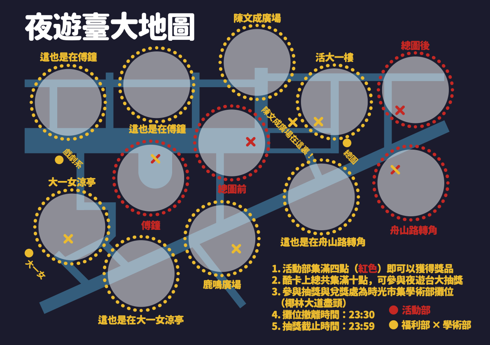
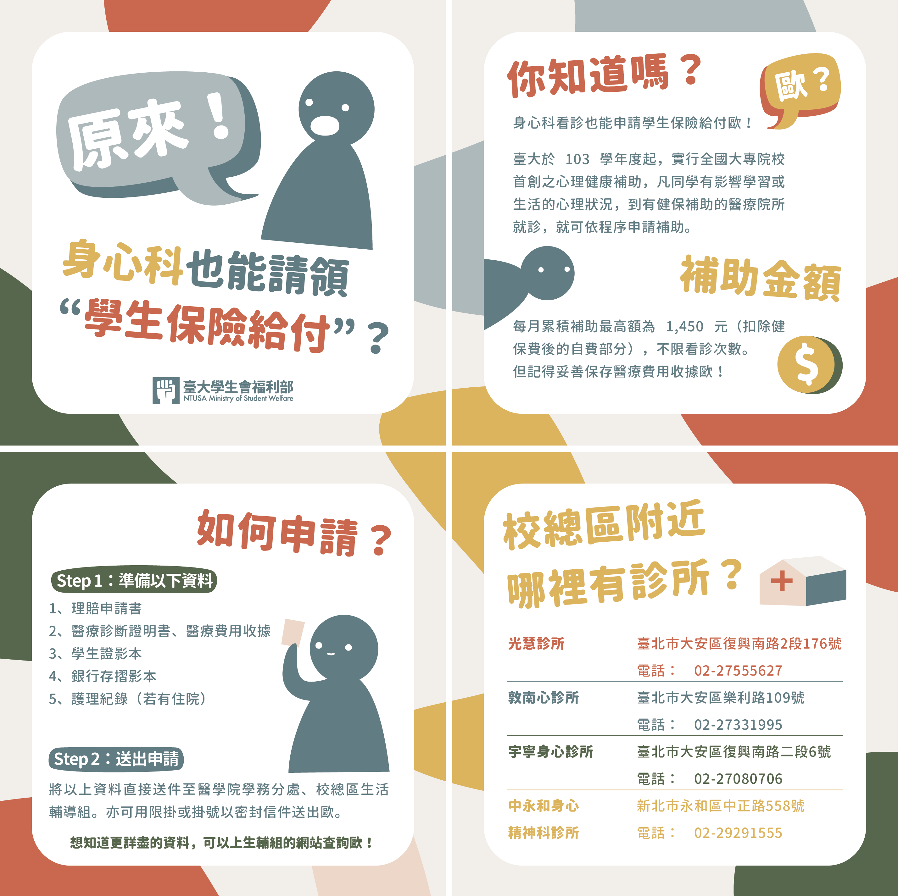

# Designs

- **校慶酷卡設計**
  
  
- **懶人包設計**
  
- **設計**
  

# Posters

- **營隊海報**
  
- **講座海報**
  

# Pamphlets and Publications

> [**RE100: Taiwan Renewable Energy Briefing**](gallery/RE100-2020_report.pdf):
> 於中華經濟研究院參與製作國際再生能源倡議組織 RE100 2020 年台灣再生能源報告書，
> 負責處理、視覺化數據與報告書排版。
> ([RE100 page](https://www.there100.org/our-work/publications/meeting-demand-supply-renewable-energy-market-briefing-taiwan))
> <iframe src='gallery/RE100-2020_report.pdf' frameborder='0' style="width:100%; height:50vw;" allowfullscreen></iframe>

> [**高級中等學校選民教育手冊**](gallery/voting_pamphlet.pdf):
> 受到青年協會與教育部國教育署委託，負責將文案排版成手冊，
> 其中內容包含將調查資料整理與視覺化；完成整本手冊之版面與設計。
> <iframe src='gallery/voting_pamphlet.pdf' frameborder='0' style="width:100%; height:50vw;" allowfullscreen></iframe>

# Random GIFs

<a href='index.html' class='back_button'><strong>HOME</strong></a>
