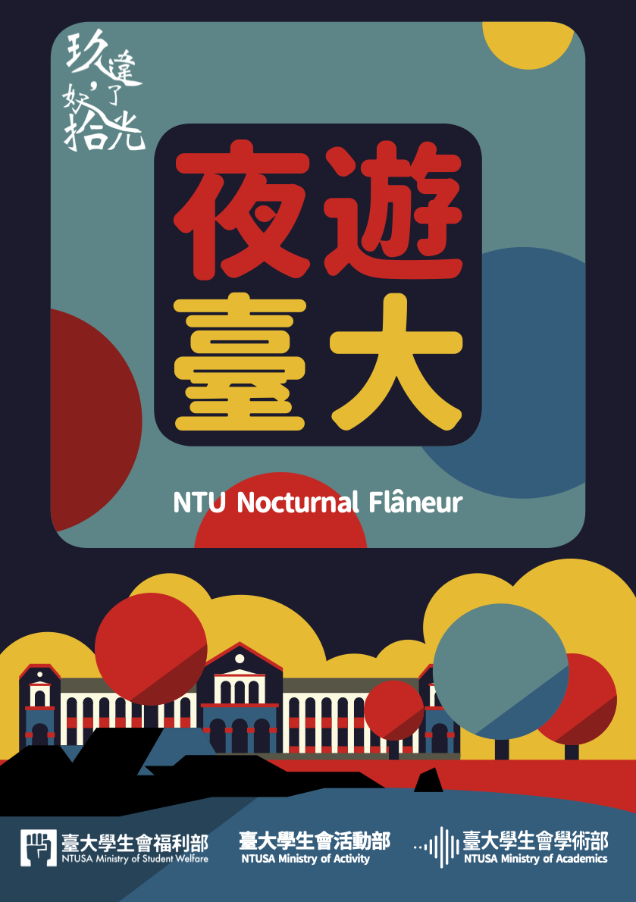
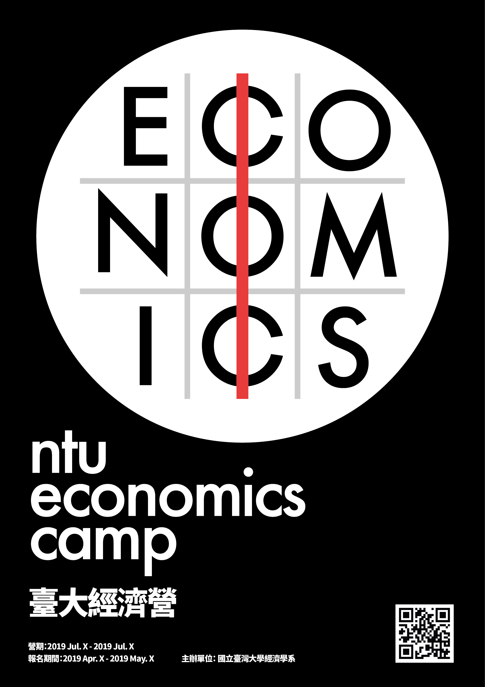
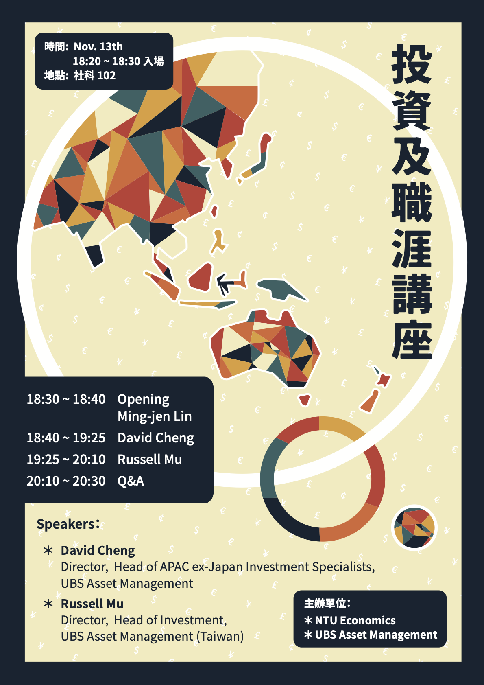

# Designs

- **身心科補助懶人包**
  
- **台灣大學校慶酷卡**
  
- **I waste time**
  

# Posters

- **台灣大學經濟營**
  
- **講座海報**
  

# Pamphlets

> [**RE100: Taiwan Renewable Energy Report**](./resources/RE100-2020_report.pdf):
> 於中華經濟研究院參與製作國際再生能源倡議組織 RE100 2020 年台灣再生能源報告書，
> 負責處理、視覺化數據與報告書排版。
> ([RE100 page](https://www.there100.org/our-work/publications/meeting-demand-supply-renewable-energy-market-briefing-taiwan))
> <figure>
> 	<embed src="./resources/RE100-2020_report.pdf" width="100%" height="800px" />
> </figure>

> [**高級中等學校選民教育手冊**](./resources/voting_pamphlet.pdf):
> 受到青年協會與教育部國教育署委託，負責將文案排版成手冊，
> 其中內容包含將調查資料整理與視覺化；完成整本手冊之版面與設計。
> <figure>
> 	<embed src="./resources/voting_pamphlet.pdf" width="100%" height="800px" />
> </figure>

<a href="../index.html" class="back_button">BACK</a>
